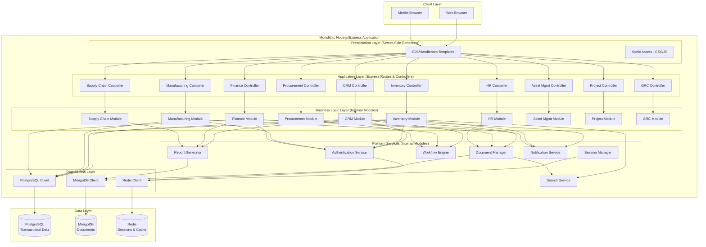
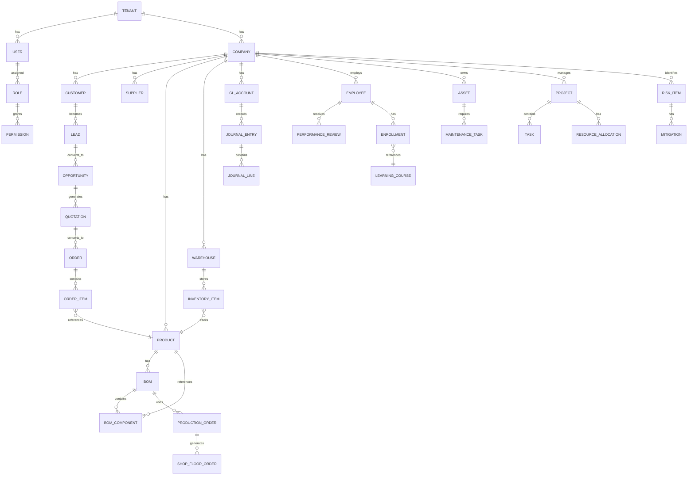
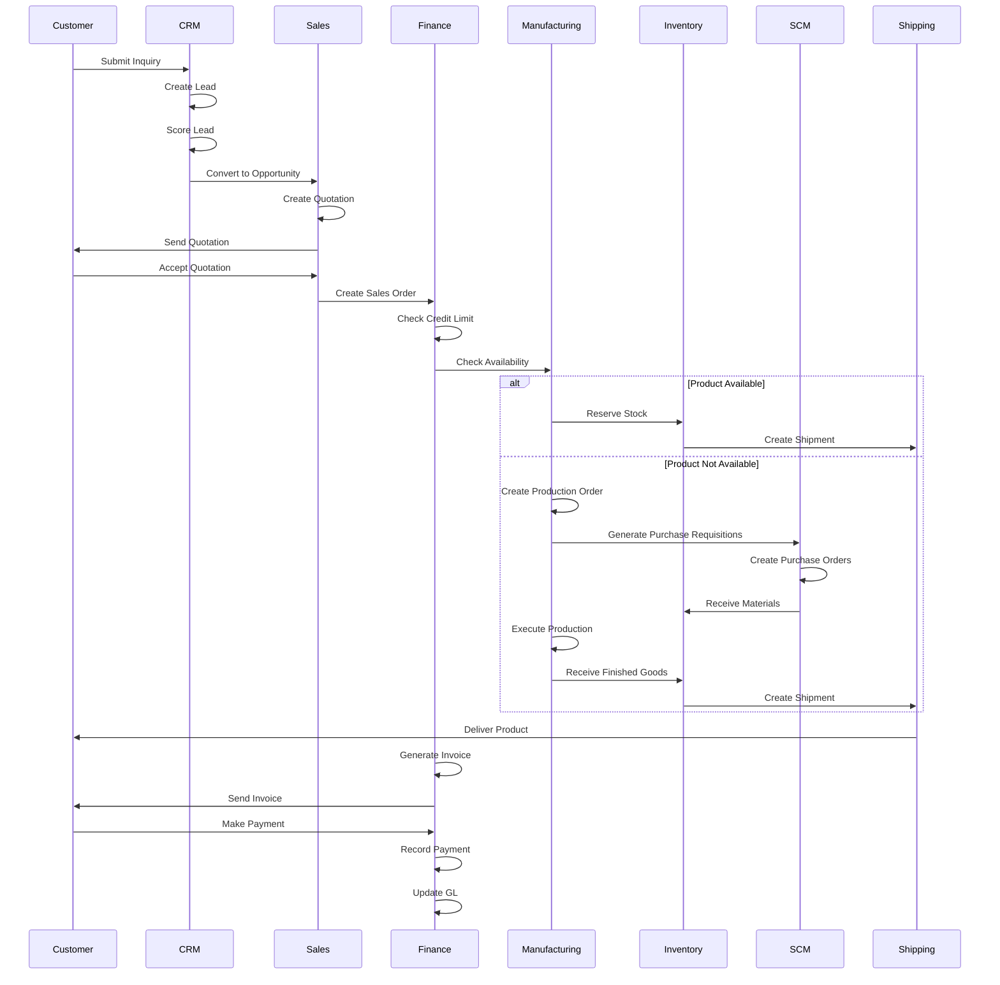
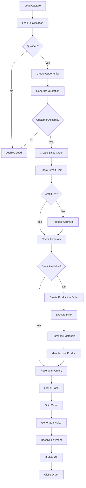
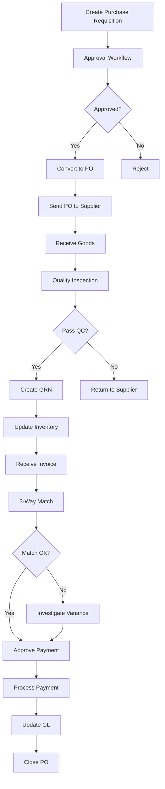

# Design Document: Comprehensive ERP Enhancement

## Overview

This design transforms NexaERP from a basic small-business ERP into an enterprise-grade platform comparable to SAP, Oracle, or Microsoft Dynamics. The enhancement adds 19 major feature areas covering CRM, advanced manufacturing, supply chain management, human capital management, governance/risk/compliance, and enterprise-grade security. The architecture follows a **monolithic approach** with traditional MVC patterns and server-side rendering, providing a unified, maintainable application with lower operational complexity.

The design uses a single Node.js/Express application with server-side rendering (EJS/Handlebars templates), direct database access (PostgreSQL/MongoDB), and internal module organization. All 19 modules are implemented as internal Node.js modules within the monolith, communicating through direct function calls rather than REST APIs. This approach provides simplicity, easier debugging, and reduced infrastructure overhead while maintaining all enterprise functionality.

## Architecture

### System Architecture Overview



### Monolithic MVC Architecture

```mermaid
graph TB
    subgraph "Single Node.js Process"
        subgraph "Routes Layer"
            R1[/crm/*]
            R2[/inventory/*]
            R3[/manufacturing/*]
            R4[/finance/*]
            R5[/hr/*]
            R6[/assets/*]
        end
        
        subgraph "Controllers Layer"
            C1[CRM Controllers]
            C2[Inventory Controllers]
            C3[Manufacturing Controllers]
            C4[Finance Controllers]
            C5[HR Controllers]
            C6[Asset Controllers]
        end
        
        subgraph "Services Layer (Business Logic)"
            S1[CRM Service]
            S2[Inventory Service]
            S3[Manufacturing Service]
            S4[Finance Service]
            S5[HR Service]
            S6[Asset Service]
        end
        
        subgraph "Models Layer (Data Access)"
            M1[Lead, Opportunity, Customer]
            M2[Product, InventoryItem, Warehouse]
            M3[BOM, ProductionOrder, WorkCenter]
            M4[Account, JournalEntry, Invoice]
            M5[Employee, Candidate, PerformanceReview]
            M6[Asset, MaintenanceTask, SparePart]
        end
        
        subgraph "Shared Services"
            AUTH[Authentication]
            SESS[Session Management]
            VALID[Validation]
            AUDIT[Audit Logging]
        end
        
        DB[(Database<br/>PostgreSQL/MongoDB)]
    end
    
    R1 --> C1
    R2 --> C2
    R3 --> C3
    R4 --> C4
    R5 --> C5
    R6 --> C6
    
    C1 --> S1
    C2 --> S2
    C3 --> S3
    C4 --> S4
    C5 --> S5
    C6 --> S6
    
    S1 --> M1
    S2 --> M2
    S3 --> M3
    S4 --> M4
    S5 --> M5
    S6 --> M6
    
    C1 --> AUTH
    C2 --> AUTH
    C3 --> AUTH
    
    S1 --> AUDIT
    S2 --> AUDIT
    S3 --> AUDIT
    
    M1 --> DB
    M2 --> DB
    M3 --> DB
    M4 --> DB
    M5 --> DB
    M6 --> DB
```

## Components and Interfaces

### 1. CRM & Sales Pipeline Module

**Purpose**: Lead-to-cash process management with opportunity tracking, quotation generation, and customer relationship management.

**Interface**:
```lean
-- Core CRM types
structure Lead where
  id : UUID
  name : String
  company : Option String
  email : Option String
  phone : Option String
  source : LeadSource
  status : LeadStatus
  score : Nat  -- 0 to 100
  assignedTo : Option UUID
  activities : List Activity
  createdAt : Timestamp
  deriving Repr, BEq

inductive LeadSource where
  | website
  | referral
  | coldCall
  | social
  | exhibition
  | partner
  | other
  deriving Repr, BEq

inductive LeadStatus where
  | new
  | contacted
  | qualified
  | unqualified
  | converted
  | lost
  deriving Repr, BEq

structure Opportunity where
  id : UUID
  leadId : Option UUID
  name : String
  accountId : UUID
  value : Decimal
  probability : Nat  -- 0 to 100
  stage : OpportunityStage
  expectedCloseDate : Date
  products : List OpportunityProduct
  competitors : List String
  nextSteps : String
  deriving Repr, BEq

inductive OpportunityStage where
  | prospecting
  | qualification
  | needsAnalysis
  | valueProposition
  | decisionMakers
  | proposalQuote
  | negotiation
  | closedWon
  | closedLost
  deriving Repr, BEq

-- CRM Service Interface
class CRMService where
  createLead : Lead → IO (Result Lead Error)
  updateLeadStatus : UUID → LeadStatus → IO (Result Lead Error)
  scoreLeadAutomatically : Lead → IO Nat
  convertLeadToOpportunity : UUID → Opportunity → IO (Result Opportunity Error)
  createQuotation : Opportunity → List Product → IO (Result Quotation Error)
  convertQuotationToInvoice : UUID → IO (Result Invoice Error)
  trackCustomerInteractions : UUID → Activity → IO (Result Unit Error)
  getForecastedRevenue : DateRange → IO Decimal
```

**Responsibilities**:
- Lead capture and qualification with automated scoring
- Opportunity pipeline management with stage progression
- Quotation generation with product catalog integration
- Sales forecasting and pipeline analytics
- Customer interaction tracking (calls, emails, meetings)
- Automated follow-up reminders and task management

### 2. Advanced Inventory Management Module

**Purpose**: Enterprise-grade inventory control with batch/lot tracking, serial numbers, expiry management, and multi-warehouse support.

**Interface**:
```lean
-- Advanced inventory types
structure InventoryItem where
  id : UUID
  productId : UUID
  warehouseId : UUID
  binLocation : Option String
  quantity : Decimal
  batchNumber : Option String
  lotNumber : Option String
  serialNumbers : List String
  expiryDate : Option Date
  manufacturingDate : Option Date
  status : InventoryStatus
  deriving Repr, BEq

inductive InventoryStatus where
  | available
  | reserved
  | quarantine
  | damaged
  | expired
  | inTransit
  deriving Repr, BEq

structure CycleCount where
  id : UUID
  warehouseId : UUID
  scheduledDate : Date
  items : List CycleCountItem
  status : CountStatus
  variance : Decimal
  deriving Repr, BEq

structure CycleCountItem where
  productId : UUID
  expectedQty : Decimal
  countedQty : Decimal
  variance : Decimal
  reason : Option String
  deriving Repr, BEq

-- Inventory Service Interface
class InventoryService where
  trackBatchLot : UUID → String → String → IO (Result Unit Error)
  assignSerialNumbers : UUID → List String → IO (Result Unit Error)
  checkExpiry : Warehouse → IO (List InventoryItem)
  performCycleCount : CycleCount → IO (Result CycleCount Error)
  optimizeReorderPoints : UUID → HistoricalData → IO ReorderPoint
  allocateInventory : Order → IO (Result Allocation Error)
  transferBetweenWarehouses : UUID → UUID → UUID → Decimal → IO (Result Transfer Error)
  getInventoryValuation : Warehouse → ValuationMethod → IO Decimal
```

**Responsibilities**:
- Batch and lot number tracking for traceability
- Serial number management for high-value items
- Expiry date monitoring with automated alerts
- Cycle counting and physical inventory reconciliation
- Warehouse bin location management
- Reorder point optimization using demand forecasting
- Multi-warehouse inventory visibility and transfers

### 3. Manufacturing & Production Module

**Purpose**: Complete manufacturing execution system with MRP, BOM management, production planning, and shop floor control.

**Interface**:
```lean
-- Manufacturing types
structure BillOfMaterials where
  id : UUID
  productId : UUID
  version : String
  isActive : Bool
  bomType : BOMType
  baseQuantity : Decimal
  components : List BOMComponent
  operations : List Operation
  totalMaterialCost : Decimal
  totalLaborCost : Decimal
  deriving Repr, BEq

inductive BOMType where
  | production
  | engineering
  | sales
  | phantom
  deriving Repr, BEq

structure BOMComponent where
  productId : UUID
  quantity : Decimal
  unit : String
  scrapFactor : Decimal
  componentType : ComponentType
  mandatory : Bool
  deriving Repr, BEq

structure ProductionOrder where
  id : UUID
  orderNumber : String
  bomId : UUID
  productId : UUID
  quantity : Decimal
  startDate : Date
  endDate : Option Date
  status : ProductionStatus
  priority : Priority
  workCenter : UUID
  operations : List OperationExecution
  materialConsumption : List MaterialConsumption
  actualOutput : Decimal
  scrapQuantity : Decimal
  deriving Repr, BEq

inductive ProductionStatus where
  | planned
  | released
  | inProgress
  | completed
  | cancelled
  | onHold
  deriving Repr, BEq

structure MRPRun where
  id : UUID
  runDate : Timestamp
  planningHorizon : Nat  -- days
  demandSources : List DemandSource
  plannedOrders : List PlannedOrder
  purchaseRequisitions : List PurchaseRequisition
  status : MRPStatus
  deriving Repr, BEq

-- Manufacturing Service Interface
class ManufacturingService where
  createBOM : BillOfMaterials → IO (Result BillOfMaterials Error)
  explodeBOM : UUID → Decimal → IO (List MaterialRequirement)
  runMRP : MRPRun → IO (Result MRPRun Error)
  createProductionOrder : ProductionOrder → IO (Result ProductionOrder Error)
  releaseProductionOrder : UUID → IO (Result Unit Error)
  recordMaterialConsumption : UUID → List MaterialConsumption → IO (Result Unit Error)
  recordProductionOutput : UUID → Decimal → IO (Result Unit Error)
  performQualityInspection : UUID → QualityChecklist → IO (Result QualityResult Error)
  calculateCapacityRequirements : List ProductionOrder → IO CapacityPlan
```

**Responsibilities**:
- Multi-level BOM management with versioning
- MRP calculation for material and capacity planning
- Production order creation and scheduling
- Shop floor execution and progress tracking
- Material consumption and backflushing
- Quality inspection and control
- Work center capacity planning
- Production costing and variance analysis

### 4. Full Accounting Suite Module

**Purpose**: Complete double-entry accounting system with GL, AP/AR, bank reconciliation, budgeting, and financial reporting.

**Interface**:
```lean
-- Accounting types
structure ChartOfAccounts where
  accounts : List GLAccount
  deriving Repr, BEq

structure GLAccount where
  id : UUID
  accountCode : String
  accountName : String
  accountType : AccountType
  parentAccount : Option UUID
  isActive : Bool
  currency : String
  balance : Decimal
  deriving Repr, BEq

inductive AccountType where
  | asset
  | liability
  | equity
  | revenue
  | expense
  | costOfGoodsSold
  deriving Repr, BEq

structure JournalEntry where
  id : UUID
  entryNumber : String
  entryDate : Date
  postingDate : Date
  description : String
  lines : List JournalLine
  status : EntryStatus
  sourceDocument : Option String
  createdBy : UUID
  deriving Repr, BEq

structure JournalLine where
  accountId : UUID
  debit : Decimal
  credit : Decimal
  description : String
  costCenter : Option UUID
  project : Option UUID
  deriving Repr, BEq

structure BankReconciliation where
  id : UUID
  bankAccount : UUID
  statementDate : Date
  statementBalance : Decimal
  bookBalance : Decimal
  matchedTransactions : List UUID
  unmatchedBankItems : List BankTransaction
  unmatchedBookItems : List JournalEntry
  adjustments : List JournalEntry
  reconciledBalance : Decimal
  deriving Repr, BEq

-- Accounting Service Interface
class AccountingService where
  createJournalEntry : JournalEntry → IO (Result JournalEntry Error)
  postJournalEntry : UUID → IO (Result Unit Error)
  reverseJournalEntry : UUID → Date → IO (Result JournalEntry Error)
  getTrialBalance : Date → IO TrialBalance
  generateFinancialStatements : DateRange → IO FinancialStatements
  reconcileBank : BankReconciliation → IO (Result BankReconciliation Error)
  createBudget : Budget → IO (Result Budget Error)
  trackBudgetVariance : UUID → DateRange → IO BudgetVariance
  calculateCashFlow : DateRange → IO CashFlowStatement
  depreciateFixedAssets : Date → IO (List JournalEntry)
```

**Responsibilities**:
- Double-entry bookkeeping with automated journal entries
- Chart of accounts management with hierarchical structure
- Accounts payable and receivable management
- Bank reconciliation with automated matching
- Budget creation and variance tracking
- Cash flow forecasting and management
- Fixed asset depreciation (straight-line, declining balance)
- Financial statement generation (P&L, Balance Sheet, Cash Flow)
- Multi-currency support with exchange rate management

### 5. RBAC & Enterprise Security Module

**Purpose**: Role-based access control with approval hierarchies, SSO integration, MFA, and field-level permissions.

**Interface**:
```lean
-- Security types
structure Role where
  id : UUID
  name : String
  description : String
  permissions : List Permission
  isSystemRole : Bool
  deriving Repr, BEq

structure Permission where
  resource : String
  actions : List Action
  conditions : Option AccessCondition
  deriving Repr, BEq

inductive Action where
  | create
  | read
  | update
  | delete
  | approve
  | execute
  deriving Repr, BEq

structure AccessCondition where
  field : String
  operator : Operator
  value : String
  deriving Repr, BEq

structure ApprovalHierarchy where
  id : UUID
  name : String
  documentType : String
  levels : List ApprovalLevel
  deriving Repr, BEq

structure ApprovalLevel where
  level : Nat
  approvers : List UUID
  condition : Option String
  requiredApprovals : Nat
  deriving Repr, BEq

-- Security Service Interface
class SecurityService where
  createRole : Role → IO (Result Role Error)
  assignRoleToUser : UUID → UUID → IO (Result Unit Error)
  checkPermission : UUID → String → Action → IO Bool
  enforceFieldLevelSecurity : UUID → String → List String → IO (List String)
  authenticateSSO : SSOProvider → Token → IO (Result User Error)
  enableMFA : UUID → MFAMethod → IO (Result MFASecret Error)
  verifyMFA : UUID → String → IO Bool
  createApprovalWorkflow : ApprovalHierarchy → IO (Result ApprovalHierarchy Error)
  submitForApproval : UUID → String → IO (Result Approval Error)
  processApproval : UUID → UUID → ApprovalDecision → IO (Result Unit Error)
```

**Responsibilities**:
- Role-based permission management with inheritance
- Field-level and record-level security
- SSO integration (Google, Microsoft, SAML, OAuth2)
- Multi-factor authentication (TOTP, SMS, email)
- Approval workflow engine with multi-level hierarchies
- Segregation of duties (SoD) enforcement
- Audit trail for all security events
- Session management and token refresh


### 6. Document Management System Module

**Purpose**: Centralized document repository with OCR, version control, e-signatures, and contract management.

**Interface**:
```lean
-- Document types
structure Document where
  id : UUID
  name : String
  documentType : DocumentType
  category : String
  fileUrl : String
  fileSize : Nat
  mimeType : String
  version : Nat
  status : DocumentStatus
  tags : List String
  metadata : Map String String
  linkedEntity : Option EntityReference
  uploadedBy : UUID
  uploadedAt : Timestamp
  deriving Repr, BEq

inductive DocumentType where
  | invoice
  | purchaseOrder
  | contract
  | receipt
  | certificate
  | report
  | other
  deriving Repr, BEq

inductive DocumentStatus where
  | draft
  | pending
  | approved
  | rejected
  | archived
  deriving Repr, BEq

structure DocumentVersion where
  version : Nat
  fileUrl : String
  uploadedBy : UUID
  uploadedAt : Timestamp
  changes : String
  deriving Repr, BEq

structure ESignatureRequest where
  id : UUID
  documentId : UUID
  signers : List Signer
  message : String
  expiryDate : Date
  status : SignatureStatus
  deriving Repr, BEq

structure Signer where
  email : String
  name : String
  order : Nat
  signedAt : Option Timestamp
  ipAddress : Option String
  deriving Repr, BEq

-- Document Service Interface
class DocumentService where
  uploadDocument : Document → ByteArray → IO (Result Document Error)
  performOCR : UUID → IO (Result OCRResult Error)
  extractInvoiceData : UUID → IO (Result InvoiceData Error)
  versionDocument : UUID → ByteArray → String → IO (Result Document Error)
  requestESignature : ESignatureRequest → IO (Result ESignatureRequest Error)
  signDocument : UUID → UUID → Signature → IO (Result Unit Error)
  searchDocuments : SearchCriteria → IO (List Document)
  linkDocumentToEntity : UUID → EntityReference → IO (Result Unit Error)
  archiveDocument : UUID → IO (Result Unit Error)
```

**Responsibilities**:
- Document upload and storage (S3/Azure Blob)
- OCR processing for scanned documents
- Automated invoice data extraction
- Version control with change tracking
- E-signature workflow integration
- Full-text search across documents
- Document categorization and tagging
- Entity linking (invoices to orders, contracts to customers)

### 7. Workflow Builder (No-Code) Module

**Purpose**: Visual workflow designer for business process automation without coding.

**Interface**:
```lean
-- Workflow types
structure Workflow where
  id : UUID
  name : String
  description : String
  trigger : WorkflowTrigger
  conditions : List WorkflowCondition
  actions : List WorkflowAction
  isActive : Bool
  createdBy : UUID
  deriving Repr, BEq

inductive WorkflowTrigger where
  | recordCreated (entity : String)
  | recordUpdated (entity : String) (fields : List String)
  | fieldValueChanged (entity : String) (field : String)
  | scheduled (cronExpression : String)
  | manual
  | webhook (url : String)
  deriving Repr, BEq

structure WorkflowCondition where
  field : String
  operator : ConditionOperator
  value : String
  logicalOperator : Option LogicalOperator
  deriving Repr, BEq

inductive ConditionOperator where
  | equals
  | notEquals
  | greaterThan
  | lessThan
  | contains
  | startsWith
  | isEmpty
  deriving Repr, BEq

inductive LogicalOperator where
  | and
  | or
  deriving Repr, BEq

structure WorkflowAction where
  actionType : ActionType
  parameters : Map String String
  order : Nat
  deriving Repr, BEq

inductive ActionType where
  | sendEmail (template : String) (recipients : List String)
  | sendNotification (message : String) (users : List UUID)
  | createRecord (entity : String) (data : Map String String)
  | updateRecord (entity : String) (recordId : UUID) (data : Map String String)
  | createTask (assignee : UUID) (dueDate : Date)
  | callWebhook (url : String) (method : String)
  | executeScript (code : String)
  deriving Repr, BEq

-- Workflow Service Interface
class WorkflowService where
  createWorkflow : Workflow → IO (Result Workflow Error)
  activateWorkflow : UUID → IO (Result Unit Error)
  deactivateWorkflow : UUID → IO (Result Unit Error)
  executeWorkflow : UUID → Map String String → IO (Result WorkflowExecution Error)
  evaluateConditions : List WorkflowCondition → Map String String → IO Bool
  executeActions : List WorkflowAction → Map String String → IO (Result Unit Error)
  getWorkflowExecutionHistory : UUID → IO (List WorkflowExecution)
  testWorkflow : Workflow → Map String String → IO (Result WorkflowExecution Error)
```

**Responsibilities**:
- Visual workflow designer with drag-and-drop interface
- Trigger configuration (record events, schedules, webhooks)
- Condition builder with complex logic (AND/OR)
- Action library (email, notifications, record operations, webhooks)
- Workflow execution engine with error handling
- Execution history and audit trail
- Workflow testing and debugging
- Pre-built templates (stock alerts, approval flows, reminders)

### 8. Supply Chain Management (SCM) Module

**Purpose**: End-to-end supply chain visibility with demand planning, procurement optimization, and logistics management.

**Interface**:
```lean
-- SCM types
structure DemandForecast where
  id : UUID
  productId : UUID
  forecastPeriod : DateRange
  forecastMethod : ForecastMethod
  historicalData : List DemandDataPoint
  forecastedDemand : List DemandDataPoint
  accuracy : Decimal
  deriving Repr, BEq

inductive ForecastMethod where
  | movingAverage (periods : Nat)
  | exponentialSmoothing (alpha : Decimal)
  | linearRegression
  | seasonalDecomposition
  | machineLearning (model : String)
  deriving Repr, BEq

structure DemandDataPoint where
  date : Date
  quantity : Decimal
  deriving Repr, BEq

structure SupplyPlan where
  id : UUID
  planningHorizon : DateRange
  products : List UUID
  supplyActions : List SupplyAction
  constraints : List Constraint
  totalCost : Decimal
  deriving Repr, BEq

inductive SupplyAction where
  | purchaseOrder (supplierId : UUID) (productId : UUID) (quantity : Decimal) (deliveryDate : Date)
  | productionOrder (productId : UUID) (quantity : Decimal) (startDate : Date)
  | transferOrder (fromWarehouse : UUID) (toWarehouse : UUID) (productId : UUID) (quantity : Decimal)
  deriving Repr, BEq

structure Shipment where
  id : UUID
  shipmentNumber : String
  orderId : UUID
  carrier : String
  trackingNumber : String
  origin : Location
  destination : Location
  status : ShipmentStatus
  estimatedDelivery : Date
  actualDelivery : Option Date
  items : List ShipmentItem
  deriving Repr, BEq

inductive ShipmentStatus where
  | created
  | picked
  | packed
  | shipped
  | inTransit
  | outForDelivery
  | delivered
  | exception
  deriving Repr, BEq

-- SCM Service Interface
class SCMService where
  forecastDemand : UUID → DateRange → ForecastMethod → IO (Result DemandForecast Error)
  createSupplyPlan : SupplyPlan → IO (Result SupplyPlan Error)
  optimizeProcurement : List UUID → DateRange → IO (Result List PurchaseRequisition Error)
  createShipment : Shipment → IO (Result Shipment Error)
  trackShipment : String → IO (Result ShipmentTracking Error)
  calculateLeadTime : UUID → UUID → IO Nat
  analyzeSupplierPerformance : UUID → DateRange → IO SupplierMetrics
  getInventoryVisibility : IO (List InventorySnapshot)
```

**Responsibilities**:
- Demand forecasting using statistical and ML methods
- Supply planning with constraint optimization
- Procurement optimization (EOQ, safety stock)
- Vendor collaboration portal
- Transportation management (TMS)
- Shipment tracking and visibility
- Warehouse management system (WMS) integration
- Global inventory visibility across locations

### 9. Manufacturing / Industry 4.0 Module

**Purpose**: Advanced manufacturing with MES, IoT integration, predictive maintenance, and digital twins.

**Interface**:
```lean
-- Industry 4.0 types
structure ManufacturingExecutionSystem where
  shopFloorOrders : List ShopFloorOrder
  workCenters : List WorkCenter
  realTimeData : List SensorData
  deriving Repr, BEq

structure ShopFloorOrder where
  id : UUID
  productionOrderId : UUID
  workCenterId : UUID
  operationId : UUID
  status : OperationStatus
  startTime : Option Timestamp
  endTime : Option Timestamp
  actualDuration : Option Nat
  operatorId : Option UUID
  qualityChecks : List QualityCheck
  deriving Repr, BEq

structure WorkCenter where
  id : UUID
  name : String
  type : String
  capacity : Decimal
  currentLoad : Decimal
  status : WorkCenterStatus
  maintenanceSchedule : List MaintenanceTask
  iotDevices : List IoTDevice
  deriving Repr, BEq

inductive WorkCenterStatus where
  | available
  | busy
  | maintenance
  | breakdown
  | offline
  deriving Repr, BEq

structure IoTDevice where
  id : UUID
  deviceId : String
  deviceType : String
  workCenterId : UUID
  metrics : List Metric
  lastHeartbeat : Timestamp
  deriving Repr, BEq

structure Metric where
  name : String
  value : Decimal
  unit : String
  timestamp : Timestamp
  deriving Repr, BEq

structure DigitalTwin where
  id : UUID
  physicalAssetId : UUID
  model : String
  parameters : Map String Decimal
  simulations : List Simulation
  deriving Repr, BEq

structure PredictiveMaintenance where
  assetId : UUID
  algorithm : String
  healthScore : Decimal
  predictedFailureDate : Option Date
  recommendedActions : List String
  deriving Repr, BEq

-- Industry 4.0 Service Interface
class Industry40Service where
  startShopFloorOperation : UUID → UUID → IO (Result ShopFloorOrder Error)
  completeShopFloorOperation : UUID → IO (Result Unit Error)
  ingestIoTData : UUID → List Metric → IO (Result Unit Error)
  monitorEquipmentHealth : UUID → IO (Result PredictiveMaintenance Error)
  schedulePreventiveMaintenance : UUID → Date → IO (Result MaintenanceTask Error)
  createDigitalTwin : UUID → String → IO (Result DigitalTwin Error)
  runSimulation : UUID → Map String Decimal → IO (Result Simulation Error)
  calculateOEE : UUID → DateRange → IO OEEMetrics
```

**Responsibilities**:
- Shop floor execution system (MES)
- Real-time production monitoring
- IoT device integration and data ingestion
- Equipment health monitoring
- Predictive maintenance using ML
- Digital twin creation and simulation
- OEE (Overall Equipment Effectiveness) calculation
- Production scheduling optimization

### 10. Advanced Finance Module

**Purpose**: Enterprise financial management with consolidation, multi-currency, treasury, and compliance.

**Interface**:
```lean
-- Advanced finance types
structure Consolidation where
  id : UUID
  consolidationDate : Date
  parentCompany : UUID
  subsidiaries : List UUID
  eliminationEntries : List JournalEntry
  consolidatedStatements : FinancialStatements
  deriving Repr, BEq

structure IntercompanyTransaction where
  id : UUID
  fromCompany : UUID
  toCompany : UUID
  transactionType : String
  amount : Decimal
  currency : String
  eliminationEntry : Option JournalEntry
  deriving Repr, BEq

structure TreasuryPosition where
  date : Date
  cashAccounts : List CashAccount
  investments : List Investment
  loans : List Loan
  totalLiquidity : Decimal
  deriving Repr, BEq

structure CashAccount where
  accountId : UUID
  bankName : String
  currency : String
  balance : Decimal
  deriving Repr, BEq

structure RiskExposure where
  riskType : RiskType
  exposure : Decimal
  hedges : List Hedge
  netExposure : Decimal
  deriving Repr, BEq

inductive RiskType where
  | currencyRisk
  | interestRateRisk
  | creditRisk
  | liquidityRisk
  deriving Repr, BEq

-- Advanced Finance Service Interface
class AdvancedFinanceService where
  consolidateFinancials : Consolidation → IO (Result Consolidation Error)
  recordIntercompanyTransaction : IntercompanyTransaction → IO (Result Unit Error)
  eliminateIntercompanyBalances : List UUID → Date → IO (List JournalEntry)
  convertCurrency : Decimal → String → String → Date → IO Decimal
  manageTreasuryPosition : Date → IO TreasuryPosition
  forecastCashFlow : DateRange → IO CashFlowForecast
  assessRiskExposure : RiskType → IO RiskExposure
  generateComplianceReport : String → DateRange → IO ComplianceReport
  automateFinancialClose : Date → IO (Result FinancialClose Error)
```

**Responsibilities**:
- Multi-company consolidation with eliminations
- Intercompany transaction management
- Multi-currency accounting with revaluation
- Treasury management and cash positioning
- Risk management (FX, interest rate, credit)
- Tax engine integration (Vertex, Avalara)
- IFRS/GAAP compliance reporting
- Financial close automation


### 11. Human Capital Management (HCM) Module

**Purpose**: Complete HR suite with recruitment, performance management, learning, and global payroll.

**Interface**:
```lean
-- HCM types
structure Employee where
  id : UUID
  employeeNumber : String
  personalInfo : PersonalInfo
  employment : EmploymentInfo
  compensation : CompensationInfo
  performance : List PerformanceReview
  skills : List Skill
  certifications : List Certification
  deriving Repr, BEq

structure PersonalInfo where
  firstName : String
  lastName : String
  email : String
  phone : String
  dateOfBirth : Date
  address : Address
  deriving Repr, BEq

structure EmploymentInfo where
  hireDate : Date
  department : String
  position : String
  manager : UUID
  employmentType : EmploymentType
  status : EmploymentStatus
  deriving Repr, BEq

inductive EmploymentType where
  | fullTime
  | partTime
  | contract
  | intern
  deriving Repr, BEq

inductive EmploymentStatus where
  | active
  | onLeave
  | suspended
  | terminated
  deriving Repr, BEq

structure JobRequisition where
  id : UUID
  title : String
  department : String
  positions : Nat
  description : String
  requirements : List String
  status : RequisitionStatus
  approvals : List Approval
  deriving Repr, BEq

structure Candidate where
  id : UUID
  name : String
  email : String
  phone : String
  resume : UUID
  requisitionId : UUID
  stage : RecruitmentStage
  interviews : List Interview
  score : Decimal
  deriving Repr, BEq

inductive RecruitmentStage where
  | applied
  | screening
  | phoneInterview
  | technicalInterview
  | finalInterview
  | offerExtended
  | hired
  | rejected
  deriving Repr, BEq

structure PerformanceReview where
  id : UUID
  employeeId : UUID
  reviewPeriod : DateRange
  reviewerId : UUID
  goals : List Goal
  competencies : List CompetencyRating
  overallRating : Decimal
  comments : String
  status : ReviewStatus
  deriving Repr, BEq

structure Goal where
  description : String
  weight : Decimal
  achievement : Decimal
  rating : Decimal
  deriving Repr, BEq

structure LearningCourse where
  id : UUID
  title : String
  description : String
  duration : Nat
  instructor : String
  content : List CourseModule
  enrollments : List Enrollment
  deriving Repr, BEq

structure Enrollment where
  employeeId : UUID
  enrolledDate : Date
  completionDate : Option Date
  progress : Decimal
  score : Option Decimal
  deriving Repr, BEq

-- HCM Service Interface
class HCMService where
  createJobRequisition : JobRequisition → IO (Result JobRequisition Error)
  postJobToPortals : UUID → List String → IO (Result Unit Error)
  screenCandidate : Candidate → IO (Result Decimal Error)
  scheduleInterview : UUID → Interview → IO (Result Interview Error)
  hireCandidate : UUID → EmploymentInfo → IO (Result Employee Error)
  createPerformanceReview : PerformanceReview → IO (Result PerformanceReview Error)
  calculatePerformanceRating : UUID → IO Decimal
  identifySuccessionCandidates : UUID → IO (List Employee)
  createLearningPath : UUID → List UUID → IO (Result LearningPath Error)
  enrollInCourse : UUID → UUID → IO (Result Enrollment Error)
  processGlobalPayroll : Date → List UUID → IO (Result PayrollRun Error)
```

**Responsibilities**:
- Applicant tracking system (ATS) with job posting
- Candidate screening and interview scheduling
- Performance management with goal tracking
- 360-degree feedback and competency assessments
- Succession planning and talent pools
- Learning management system (LMS)
- Course creation and enrollment
- Global payroll processing with localization
- Employee self-service portal

### 12. Enterprise Asset Management (EAM) Module

**Purpose**: Asset lifecycle management with preventive maintenance, spare parts, and equipment monitoring.

**Interface**:
```lean
-- EAM types
structure Asset where
  id : UUID
  assetNumber : String
  name : String
  category : AssetCategory
  location : Location
  status : AssetStatus
  acquisitionDate : Date
  acquisitionCost : Decimal
  currentValue : Decimal
  depreciationMethod : DepreciationMethod
  maintenanceHistory : List MaintenanceRecord
  specifications : Map String String
  deriving Repr, BEq

inductive AssetCategory where
  | machinery
  | vehicle
  | building
  | equipment
  | itAsset
  deriving Repr, BEq

inductive AssetStatus where
  | operational
  | maintenance
  | breakdown
  | retired
  | disposed
  deriving Repr, BEq

structure MaintenanceTask where
  id : UUID
  assetId : UUID
  taskType : MaintenanceType
  description : String
  scheduledDate : Date
  completedDate : Option Date
  technician : Option UUID
  spareParts : List SparePart
  cost : Decimal
  status : TaskStatus
  deriving Repr, BEq

inductive MaintenanceType where
  | preventive
  | corrective
  | predictive
  | breakdown
  deriving Repr, BEq

structure SparePart where
  productId : UUID
  quantity : Decimal
  unitCost : Decimal
  deriving Repr, BEq

structure MaintenancePlan where
  id : UUID
  assetId : UUID
  frequency : Frequency
  tasks : List String
  estimatedDuration : Nat
  requiredParts : List UUID
  deriving Repr, BEq

inductive Frequency where
  | daily
  | weekly
  | monthly
  | quarterly
  | yearly
  | basedOnUsage (threshold : Nat)
  deriving Repr, BEq

-- EAM Service Interface
class EAMService where
  registerAsset : Asset → IO (Result Asset Error)
  createMaintenancePlan : MaintenancePlan → IO (Result MaintenancePlan Error)
  schedulePreventiveMaintenance : UUID → IO (List MaintenanceTask)
  recordMaintenanceCompletion : UUID → MaintenanceRecord → IO (Result Unit Error)
  trackAssetHealth : UUID → IO HealthScore
  forecastMaintenanceCosts : UUID → DateRange → IO Decimal
  manageSparePartsInventory : IO (List SparePart)
  calculateAssetUtilization : UUID → DateRange → IO Decimal
  planPlantShutdown : Date → List UUID → IO ShutdownPlan
```

**Responsibilities**:
- Asset registration and tracking
- Preventive maintenance scheduling
- Work order management
- Spare parts inventory management
- Equipment health monitoring
- Maintenance cost tracking
- Asset utilization analysis
- Plant shutdown planning

### 13. Project Systems Module

**Purpose**: Project management with budgeting, resource allocation, cost control, and billing.

**Interface**:
```lean
-- Project types
structure Project where
  id : UUID
  projectNumber : String
  name : String
  description : String
  projectType : ProjectType
  status : ProjectStatus
  startDate : Date
  endDate : Date
  budget : Decimal
  actualCost : Decimal
  phases : List ProjectPhase
  resources : List ResourceAllocation
  milestones : List Milestone
  deriving Repr, BEq

inductive ProjectType where
  | internal
  | customerProject
  | capitalProject
  | research
  deriving Repr, BEq

inductive ProjectStatus where
  | planning
  | active
  | onHold
  | completed
  | cancelled
  deriving Repr, BEq

structure ProjectPhase where
  name : String
  startDate : Date
  endDate : Date
  budget : Decimal
  tasks : List Task
  deriving Repr, BEq

structure Task where
  id : UUID
  name : String
  description : String
  assignee : UUID
  startDate : Date
  dueDate : Date
  status : TaskStatus
  progress : Decimal
  dependencies : List UUID
  deriving Repr, BEq

structure ResourceAllocation where
  resourceId : UUID
  resourceType : ResourceType
  allocation : Decimal
  startDate : Date
  endDate : Date
  cost : Decimal
  deriving Repr, BEq

inductive ResourceType where
  | human
  | equipment
  | material
  deriving Repr, BEq

structure Milestone where
  name : String
  date : Date
  status : MilestoneStatus
  deliverables : List String
  deriving Repr, BEq

-- Project Service Interface
class ProjectService where
  createProject : Project → IO (Result Project Error)
  allocateResources : UUID → List ResourceAllocation → IO (Result Unit Error)
  trackProjectCosts : UUID → IO ProjectCostReport
  calculateEarnedValue : UUID → IO EarnedValueMetrics
  createMilestone : UUID → Milestone → IO (Result Milestone Error)
  generateProjectInvoice : UUID → DateRange → IO (Result Invoice Error)
  forecastProjectCompletion : UUID → IO Date
  analyzeResourceUtilization : DateRange → IO ResourceUtilizationReport
```

**Responsibilities**:
- Project creation and planning
- Resource allocation and leveling
- Cost tracking and control
- Earned value management (EVM)
- Milestone tracking
- Project billing and invoicing
- Project forecasting and analytics
- Resource utilization analysis

### 14. Governance, Risk & Compliance (GRC) Module

**Purpose**: Enterprise governance framework with risk management, compliance monitoring, and audit intelligence.

**Interface**:
```lean
-- GRC types
structure RiskItem where
  id : UUID
  title : String
  description : String
  category : RiskCategory
  likelihood : Nat  -- 1-5
  impact : Nat  -- 1-5
  riskScore : Nat  -- likelihood × impact
  owner : UUID
  status : RiskStatus
  mitigations : List Mitigation
  deriving Repr, BEq

inductive RiskCategory where
  | operational
  | financial
  | strategic
  | compliance
  | reputational
  | cybersecurity
  deriving Repr, BEq

inductive RiskStatus where
  | identified
  | assessed
  | mitigating
  | monitoring
  | closed
  deriving Repr, BEq

structure Mitigation where
  action : String
  owner : UUID
  dueDate : Date
  status : String
  effectiveness : Option Decimal
  deriving Repr, BEq

structure ComplianceRequirement where
  id : UUID
  regulation : String
  requirement : String
  applicability : String
  controls : List Control
  status : ComplianceStatus
  lastAssessment : Option Date
  deriving Repr, BEq

structure Control where
  id : UUID
  name : String
  description : String
  controlType : ControlType
  frequency : Frequency
  owner : UUID
  evidence : List UUID
  effectiveness : Option Decimal
  deriving Repr, BEq

inductive ControlType where
  | preventive
  | detective
  | corrective
  deriving Repr, BEq

structure AuditPlan where
  id : UUID
  auditType : AuditType
  scope : String
  startDate : Date
  endDate : Date
  auditors : List UUID
  findings : List AuditFinding
  status : AuditStatus
  deriving Repr, BEq

inductive AuditType where
  | internal
  | external
  | regulatory
  | sox
  deriving Repr, BEq

structure AuditFinding where
  severity : Severity
  description : String
  recommendation : String
  remediation : Option Remediation
  deriving Repr, BEq

inductive Severity where
  | low
  | medium
  | high
  | critical
  deriving Repr, BEq

-- GRC Service Interface
class GRCService where
  createRiskItem : RiskItem → IO (Result RiskItem Error)
  assessRisk : UUID → Nat → Nat → IO (Result Unit Error)
  createMitigation : UUID → Mitigation → IO (Result Unit Error)
  monitorRisks : IO (List RiskItem)
  defineComplianceRequirement : ComplianceRequirement → IO (Result ComplianceRequirement Error)
  assessCompliance : UUID → IO ComplianceStatus
  checkSegregationOfDuties : UUID → UUID → IO (Result SoDViolation Error)
  createAuditPlan : AuditPlan → IO (Result AuditPlan Error)
  recordAuditFinding : UUID → AuditFinding → IO (Result Unit Error)
  generateComplianceReport : String → IO ComplianceReport
  generateESGReport : DateRange → IO ESGReport
```

**Responsibilities**:
- Risk identification and assessment
- Risk mitigation tracking
- Compliance requirement management
- Control effectiveness monitoring
- Segregation of duties (SoD) enforcement
- Audit planning and execution
- Audit finding remediation tracking
- Regulatory reporting (SOX, GDPR, etc.)
- ESG (Environmental, Social, Governance) reporting

### 15. Enterprise Security Architecture Module

**Purpose**: Zero-trust security with SSO, RBAC/ABAC, encryption, and SIEM integration.

**Interface**:
```lean
-- Security architecture types
structure SecurityPolicy where
  id : UUID
  name : String
  policyType : PolicyType
  rules : List SecurityRule
  isActive : Bool
  deriving Repr, BEq

inductive PolicyType where
  | authentication
  | authorization
  | dataProtection
  | networkSecurity
  | incidentResponse
  deriving Repr, BEq

structure SecurityRule where
  condition : String
  action : SecurityAction
  priority : Nat
  deriving Repr, BEq

inductive SecurityAction where
  | allow
  | deny
  | mfa
  | log
  | alert
  deriving Repr, BEq

structure AccessRequest where
  userId : UUID
  resource : String
  action : String
  context : AccessContext
  deriving Repr, BEq

structure AccessContext where
  ipAddress : String
  deviceId : String
  location : String
  timestamp : Timestamp
  riskScore : Decimal
  deriving Repr, BEq

structure SecurityEvent where
  id : UUID
  eventType : EventType
  severity : Severity
  userId : Option UUID
  resource : String
  action : String
  timestamp : Timestamp
  details : Map String String
  deriving Repr, BEq

inductive EventType where
  | loginSuccess
  | loginFailure
  | accessDenied
  | dataExfiltration
  | privilegeEscalation
  | suspiciousActivity
  deriving Repr, BEq

-- Security Service Interface
class EnterpriseSecurityService where
  authenticateWithSSO : SSOProvider → Token → IO (Result User Error)
  evaluateAccessRequest : AccessRequest → IO AccessDecision
  enforceZeroTrust : AccessRequest → IO Bool
  encryptData : ByteArray → EncryptionKey → IO ByteArray
  decryptData : ByteArray → EncryptionKey → IO ByteArray
  rotateEncryptionKeys : IO (Result Unit Error)
  logSecurityEvent : SecurityEvent → IO (Result Unit Error)
  detectAnomalies : List SecurityEvent → IO (List Anomaly)
  integrateWithSIEM : SecurityEvent → IO (Result Unit Error)
  conductSecurityAudit : IO SecurityAuditReport
```

**Responsibilities**:
- SSO integration (SAML, OAuth2, OpenID Connect)
- LDAP/Active Directory integration
- Role-based access control (RBAC)
- Attribute-based access control (ABAC)
- Zero-trust network access
- Data encryption at rest and in transit
- Key management and rotation
- Security event logging
- Anomaly detection
- SIEM integration (Splunk, QRadar)
- Security audit and compliance


### 16. Data & Analytics Layer Module

**Purpose**: Enterprise data warehouse with BI dashboards, predictive analytics, and AI copilots.

**Interface**:
```lean
-- Analytics types
structure DataWarehouse where
  dimensions : List Dimension
  facts : List FactTable
  etlJobs : List ETLJob
  deriving Repr, BEq

structure Dimension where
  name : String
  attributes : List Attribute
  hierarchies : List Hierarchy
  deriving Repr, BEq

structure FactTable where
  name : String
  measures : List Measure
  dimensions : List String
  granularity : String
  deriving Repr, BEq

structure Dashboard where
  id : UUID
  name : String
  category : String
  widgets : List Widget
  filters : List Filter
  refreshInterval : Option Nat
  deriving Repr, BEq

structure Widget where
  id : UUID
  widgetType : WidgetType
  title : String
  dataSource : DataSource
  configuration : Map String String
  deriving Repr, BEq

inductive WidgetType where
  | lineChart
  | barChart
  | pieChart
  | table
  | kpi
  | heatmap
  | gauge
  deriving Repr, BEq

structure KPI where
  id : UUID
  name : String
  formula : String
  target : Decimal
  actual : Decimal
  variance : Decimal
  trend : Trend
  deriving Repr, BEq

inductive Trend where
  | up
  | down
  | stable
  deriving Repr, BEq

structure PredictiveModel where
  id : UUID
  name : String
  modelType : ModelType
  features : List String
  target : String
  accuracy : Decimal
  lastTrained : Timestamp
  deriving Repr, BEq

inductive ModelType where
  | regression
  | classification
  | timeSeries
  | clustering
  | neuralNetwork
  deriving Repr, BEq

-- Analytics Service Interface
class AnalyticsService where
  createDashboard : Dashboard → IO (Result Dashboard Error)
  executeQuery : String → IO QueryResult
  calculateKPI : UUID → IO KPI
  generateReport : ReportTemplate → Map String String → IO Report
  trainPredictiveModel : PredictiveModel → List DataPoint → IO (Result PredictiveModel Error)
  makePrediction : UUID → Map String String → IO Prediction
  runWhatIfSimulation : Scenario → IO SimulationResult
  embedAnalytics : String → IO EmbedToken
  createAICopilot : String → IO (Result Copilot Error)
  queryWithNaturalLanguage : String → IO QueryResult
```

**Responsibilities**:
- Data warehouse design and ETL
- BI dashboard creation with drag-and-drop
- Executive cockpits with real-time KPIs
- KPI scorecards with targets and trends
- Predictive analytics (demand, churn, revenue)
- What-if scenario simulation
- Embedded analytics for external portals
- AI copilot for natural language queries
- Automated insight generation

### 17. Industry-Specific Modules

**Purpose**: Vertical-specific functionality for manufacturing, healthcare, banking, oil & gas, and government.

**Interface**:
```lean
-- Industry-specific types
structure ManufacturingIndustry where
  plm : ProductLifecycleManagement
  mes : ManufacturingExecutionSystem
  qms : QualityManagementSystem
  deriving Repr, BEq

structure ProductLifecycleManagement where
  products : List ProductDesign
  changeOrders : List EngineeringChangeOrder
  documents : List TechnicalDocument
  deriving Repr, BEq

structure QualityManagementSystem where
  inspectionPlans : List InspectionPlan
  nonConformances : List NonConformance
  correctiveActions : List CorrectiveAction
  certifications : List QualityCertification
  deriving Repr, BEq

structure HealthcareIndustry where
  patientRecords : List PatientRecord
  appointments : List Appointment
  billing : HealthcareBilling
  compliance : HIPAACompliance
  deriving Repr, BEq

structure PatientRecord where
  patientId : UUID
  demographics : Demographics
  medicalHistory : List MedicalEvent
  prescriptions : List Prescription
  labResults : List LabResult
  deriving Repr, BEq

structure BankingIndustry where
  accounts : List BankAccount
  loans : List Loan
  transactions : List BankTransaction
  compliance : BankingCompliance
  deriving Repr, BEq

structure BankingCompliance where
  amlChecks : List AMLCheck
  kycVerifications : List KYCVerification
  regulatoryReports : List RegulatoryReport
  deriving Repr, BEq

-- Industry Service Interface
class IndustryService where
  -- Manufacturing
  createEngineeringChangeOrder : EngineeringChangeOrder → IO (Result EngineeringChangeOrder Error)
  performQualityInspection : UUID → InspectionPlan → IO (Result InspectionResult Error)
  recordNonConformance : NonConformance → IO (Result NonConformance Error)
  
  -- Healthcare
  createPatientRecord : PatientRecord → IO (Result PatientRecord Error)
  scheduleAppointment : Appointment → IO (Result Appointment Error)
  generateHealthcareClaim : UUID → IO (Result Claim Error)
  ensureHIPAACompliance : UUID → IO ComplianceStatus
  
  -- Banking
  openBankAccount : BankAccount → IO (Result BankAccount Error)
  processLoanApplication : LoanApplication → IO (Result Loan Error)
  performAMLCheck : UUID → IO (Result AMLCheck Error)
  verifyKYC : UUID → IO (Result KYCVerification Error)
```

**Responsibilities**:
- **Manufacturing**: PLM, MES, Quality Management
- **Healthcare**: EMR, appointment scheduling, HIPAA compliance
- **Banking**: Core banking, loans, AML/KYC
- **Oil & Gas**: Field operations, well management
- **Government**: Citizen services, grants management

### 18. Global Enterprise Features Module

**Purpose**: Multi-country support with localization, global tax engines, and compliance packs.

**Interface**:
```lean
-- Global features types
structure Localization where
  country : String
  language : String
  currency : String
  dateFormat : String
  numberFormat : String
  taxRules : List TaxRule
  complianceRequirements : List ComplianceRequirement
  deriving Repr, BEq

structure TaxRule where
  taxType : TaxType
  rate : Decimal
  applicability : String
  effectiveDate : Date
  deriving Repr, BEq

inductive TaxType where
  | vat
  | gst
  | salesTax
  | incomeTax
  | withholding
  | customs
  deriving Repr, BEq

structure TransferPricing where
  fromEntity : UUID
  toEntity : UUID
  transactionType : String
  armLengthPrice : Decimal
  actualPrice : Decimal
  documentation : List UUID
  deriving Repr, BEq

structure GlobalSupplyNetwork where
  nodes : List SupplyNode
  routes : List SupplyRoute
  constraints : List Constraint
  deriving Repr, BEq

structure SupplyNode where
  id : UUID
  nodeType : NodeType
  location : Location
  capacity : Decimal
  cost : Decimal
  deriving Repr, BEq

inductive NodeType where
  | supplier
  | manufacturer
  | warehouse
  | distributionCenter
  | customer
  deriving Repr, BEq

-- Global Service Interface
class GlobalService where
  applyLocalization : String → IO Localization
  calculateTax : Decimal → String → String → IO TaxCalculation
  validateTaxCompliance : Transaction → IO (Result Unit Error)
  recordTransferPricing : TransferPricing → IO (Result Unit Error)
  optimizeGlobalSupplyNetwork : GlobalSupplyNetwork → IO OptimizationResult
  generateCountryComplianceReport : String → DateRange → IO ComplianceReport
  convertToLocalCurrency : Decimal → String → String → Date → IO Decimal
  translateContent : String → String → String → IO String
```

**Responsibilities**:
- Country-specific localization (50+ countries)
- Multi-language support with translation
- Global tax engine integration (Vertex, Avalara)
- Transfer pricing documentation
- Country-wise compliance packs
- Global supply network optimization
- Multi-currency with real-time rates
- Regional regulatory reporting

### 19. Platform & Architecture Module

**Purpose**: Multi-tenant platform with microservices, event-driven architecture, and low-code customization.

**Interface**:
```lean
-- Platform types
structure Tenant where
  id : UUID
  name : String
  domain : String
  plan : SubscriptionPlan
  features : List String
  configuration : Map String String
  status : TenantStatus
  deriving Repr, BEq

inductive TenantStatus where
  | active
  | suspended
  | trial
  | cancelled
  deriving Repr, BEq

structure Microservice where
  name : String
  version : String
  endpoints : List Endpoint
  dependencies : List String
  healthCheck : String
  deriving Repr, BEq

structure Endpoint where
  path : String
  method : HTTPMethod
  authentication : Bool
  rateLimit : Option Nat
  deriving Repr, BEq

inductive HTTPMethod where
  | GET
  | POST
  | PUT
  | PATCH
  | DELETE
  deriving Repr, BEq

structure Event where
  id : UUID
  eventType : String
  source : String
  payload : Map String String
  timestamp : Timestamp
  deriving Repr, BEq

structure CustomEntity where
  id : UUID
  name : String
  fields : List CustomField
  relationships : List Relationship
  validations : List Validation
  deriving Repr, BEq

structure CustomField where
  name : String
  fieldType : FieldType
  required : Bool
  defaultValue : Option String
  deriving Repr, BEq

inductive FieldType where
  | text
  | number
  | date
  | boolean
  | picklist
  | lookup
  deriving Repr, BEq

-- Platform Service Interface
class PlatformService where
  createTenant : Tenant → IO (Result Tenant Error)
  provisionTenant : UUID → IO (Result Unit Error)
  deployMicroservice : Microservice → IO (Result Unit Error)
  publishEvent : Event → IO (Result Unit Error)
  subscribeToEvent : String → (Event → IO Unit) → IO (Result Unit Error)
  createCustomEntity : CustomEntity → IO (Result CustomEntity Error)
  generateAPI : UUID → IO APISpecification
  createLowCodeApp : AppDefinition → IO (Result App Error)
  executeBusinessRule : UUID → Map String String → IO (Result Unit Error)
```

**Responsibilities**:
- Multi-tenant architecture with data isolation
- On-premise deployment support
- Microservices orchestration
- Event-driven architecture (Kafka/RabbitMQ)
- API gateway with rate limiting
- Workflow engine (Camunda/Temporal)
- BPM suite for process modeling
- Rule engine for business logic
- Low-code customization studio
- Custom entity and field creation

## Data Models

### Core Entity Relationship Diagram



### Key Data Models

#### 1. CRM Data Model

```lean
-- Lead entity with scoring
def Lead.calculateScore (lead : Lead) : Nat :=
  let sourceScore := match lead.source with
    | LeadSource.referral => 30
    | LeadSource.website => 20
    | LeadSource.exhibition => 25
    | _ => 10
  let activityScore := lead.activities.length * 5
  let ageScore := if lead.createdAt > (Timestamp.now - 7.days) then 20 else 0
  min 100 (sourceScore + activityScore + ageScore)

-- Opportunity probability calculation
def Opportunity.calculateProbability (opp : Opportunity) : Nat :=
  match opp.stage with
  | OpportunityStage.prospecting => 10
  | OpportunityStage.qualification => 20
  | OpportunityStage.needsAnalysis => 30
  | OpportunityStage.valueProposition => 40
  | OpportunityStage.decisionMakers => 50
  | OpportunityStage.proposalQuote => 70
  | OpportunityStage.negotiation => 80
  | OpportunityStage.closedWon => 100
  | OpportunityStage.closedLost => 0
```

#### 2. Inventory Data Model

```lean
-- Inventory valuation methods
inductive ValuationMethod where
  | fifo
  | lifo
  | weightedAverage
  | standardCost
  deriving Repr, BEq

-- Calculate inventory value
def InventoryItem.calculateValue (item : InventoryItem) (method : ValuationMethod) : Decimal :=
  match method with
  | ValuationMethod.fifo => calculateFIFO item
  | ValuationMethod.lifo => calculateLIFO item
  | ValuationMethod.weightedAverage => calculateWeightedAverage item
  | ValuationMethod.standardCost => item.quantity * item.standardCost

-- Reorder point calculation
def Product.calculateReorderPoint (product : Product) (leadTime : Nat) (demandVariability : Decimal) : Decimal :=
  let avgDailyDemand := product.avgMonthlyDemand / 30
  let safetyStock := avgDailyDemand * demandVariability * (Float.sqrt leadTime)
  (avgDailyDemand * leadTime) + safetyStock
```

#### 3. Manufacturing Data Model

```lean
-- BOM explosion (multi-level)
def BOM.explode (bom : BOM) (quantity : Decimal) : IO (List MaterialRequirement) := do
  let mut requirements := []
  for component in bom.components do
    let requiredQty := component.quantity * quantity * (1 + component.scrapFactor)
    requirements := requirements.append [{ productId := component.productId, quantity := requiredQty }]
    
    -- Recursive explosion for sub-assemblies
    if let some subBOM := await BOM.findByProduct component.productId then
      let subRequirements := await subBOM.explode requiredQty
      requirements := requirements.append subRequirements
  
  return requirements

-- MRP net requirements calculation
def MRP.calculateNetRequirements (product : Product) (grossReq : Decimal) : IO Decimal := do
  let onHand := await Inventory.getQuantity product.id
  let scheduled := await ProductionOrder.getScheduledQuantity product.id
  let allocated := await Order.getAllocatedQuantity product.id
  return max 0 (grossReq - onHand - scheduled + allocated)
```

#### 4. Finance Data Model

```lean
-- Journal entry validation (double-entry)
def JournalEntry.validate (entry : JournalEntry) : Result Unit Error :=
  let totalDebits := entry.lines.foldl (fun acc line => acc + line.debit) 0
  let totalCredits := entry.lines.foldl (fun acc line => acc + line.credit) 0
  if totalDebits != totalCredits then
    Result.error "Debits must equal credits"
  else if entry.lines.isEmpty then
    Result.error "Entry must have at least one line"
  else
    Result.ok ()

-- Financial statement generation
def FinancialStatements.generate (dateRange : DateRange) : IO FinancialStatements := do
  let entries := await JournalEntry.findByDateRange dateRange
  let trialBalance := await TrialBalance.calculate dateRange
  
  let revenue := await GLAccount.sumByType AccountType.revenue dateRange
  let expenses := await GLAccount.sumByType AccountType.expense dateRange
  let netIncome := revenue - expenses
  
  let assets := await GLAccount.sumByType AccountType.asset dateRange.endDate
  let liabilities := await GLAccount.sumByType AccountType.liability dateRange.endDate
  let equity := await GLAccount.sumByType AccountType.equity dateRange.endDate
  
  return {
    incomeStatement := { revenue, expenses, netIncome },
    balanceSheet := { assets, liabilities, equity },
    cashFlowStatement := await CashFlow.calculate dateRange
  }
```


## Main Algorithm/Workflow

### End-to-End Business Process Flow



### Order-to-Cash Process



### Procure-to-Pay Process



## Algorithmic Pseudocode

### 1. Lead Scoring Algorithm

```lean
-- Lead scoring with machine learning
def scoreLeadAutomatically (lead : Lead) : IO Nat := do
  -- Rule-based scoring
  let sourceScore := match lead.source with
    | LeadSource.referral => 30
    | LeadSource.website => 20
    | LeadSource.exhibition => 25
    | LeadSource.coldCall => 10
    | _ => 15
  
  -- Activity-based scoring
  let activityScore := lead.activities.foldl (fun acc activity =>
    acc + match activity.type with
      | ActivityType.meeting => 15
      | ActivityType.demo => 20
      | ActivityType.call => 5
      | ActivityType.email => 3
      | _ => 1
  ) 0
  
  -- Recency scoring
  let daysSinceCreation := (Timestamp.now - lead.createdAt).days
  let recencyScore := if daysSinceCreation < 7 then 20
                      else if daysSinceCreation < 30 then 10
                      else 0
  
  -- Company size scoring (if available)
  let companySizeScore := match lead.company with
    | some company =>
        if company.employees > 1000 then 15
        else if company.employees > 100 then 10
        else 5
    | none => 0
  
  -- ML-based scoring (optional enhancement)
  let mlScore := await MLModel.predict "lead_scoring" {
    source := lead.source,
    activityCount := lead.activities.length,
    daysSinceCreation := daysSinceCreation,
    hasCompany := lead.company.isSome
  }
  
  -- Combine scores (weighted average)
  let totalScore := (sourceScore * 0.3 + activityScore * 0.3 + 
                     recencyScore * 0.2 + companySizeScore * 0.1 + 
                     mlScore * 0.1)
  
  return min 100 (totalScore.toNat)

-- Preconditions:
-- - lead is a valid Lead object
-- - lead.createdAt is a valid timestamp
-- - MLModel.predict is available and trained

-- Postconditions:
-- - Returns score between 0 and 100
-- - Higher score indicates higher quality lead
-- - Score is deterministic for same input (excluding ML component)
```

### 2. MRP Calculation Algorithm

```lean
-- Material Requirements Planning (MRP)
def runMRP (mrpRun : MRPRun) : IO (Result MRPRun Error) := do
  try
    -- Step 1: Gather demand sources
    let mut grossRequirements := Map.empty
    
    for demandSource in mrpRun.demandSources do
      match demandSource with
      | DemandSource.salesOrder order =>
          for item in order.items do
            grossRequirements := grossRequirements.insert item.productId 
              (grossRequirements.getD item.productId 0 + item.quantity)
      
      | DemandSource.forecast forecast =>
          for item in forecast.items do
            grossRequirements := grossRequirements.insert item.productId
              (grossRequirements.getD item.productId 0 + item.quantity)
      
      | _ => continue
    
    -- Step 2: Calculate net requirements for each product
    let mut plannedOrders := []
    let mut purchaseRequisitions := []
    
    for (productId, grossReq) in grossRequirements.toList do
      -- Get current inventory
      let onHand := await Inventory.getQuantity productId
      let scheduled := await ProductionOrder.getScheduledQuantity productId
      let allocated := await Order.getAllocatedQuantity productId
      
      -- Calculate net requirement
      let netReq := max 0 (grossReq - onHand - scheduled + allocated)
      
      if netReq > 0 then
        let product := await Product.findById productId
        
        -- Check if product is manufactured or purchased
        if let some bom := await BOM.findByProduct productId then
          -- Manufactured: Create planned production order
          let plannedOrder := {
            productId := productId,
            quantity := netReq,
            startDate := calculateStartDate netReq product.leadTime,
            endDate := calculateEndDate netReq product.leadTime
          }
          plannedOrders := plannedOrders.append [plannedOrder]
          
          -- Explode BOM to get component requirements
          let components := await bom.explode netReq
          for component in components do
            grossRequirements := grossRequirements.insert component.productId
              (grossRequirements.getD component.productId 0 + component.quantity)
        
        else
          -- Purchased: Create purchase requisition
          let pr := {
            productId := productId,
            quantity := netReq,
            requiredDate := Date.now + product.leadTime
          }
          purchaseRequisitions := purchaseRequisitions.append [pr]
    
    -- Step 3: Update MRP run with results
    let updatedRun := { mrpRun with
      plannedOrders := plannedOrders,
      purchaseRequisitions := purchaseRequisitions,
      status := MRPStatus.completed
    }
    
    return Result.ok updatedRun
  
  catch e =>
    return Result.error e

-- Preconditions:
-- - mrpRun contains valid demand sources
-- - All referenced products exist in database
-- - BOM data is accurate and up-to-date
-- - Inventory data is current

-- Postconditions:
-- - Returns completed MRP run with planned orders and purchase requisitions
-- - All net requirements are covered by planned actions
-- - BOM explosion is performed recursively for all manufactured items
-- - No duplicate planned orders are created

-- Loop Invariants:
-- - grossRequirements map contains cumulative demand for all processed items
-- - All processed products have either planned order or purchase requisition
-- - Net requirements are always non-negative
```

### 3. Inventory Allocation Algorithm

```lean
-- Allocate inventory to orders using FIFO with reservation
def allocateInventory (order : Order) : IO (Result Allocation Error) := do
  try
    let mut allocations := []
    
    for item in order.items do
      -- Get available inventory items sorted by FIFO
      let inventoryItems := await InventoryItem.findAvailable 
        item.productId 
        order.warehouseId
        (sortBy := "manufacturingDate ASC")
      
      let mut remainingQty := item.quantity
      let mut itemAllocations := []
      
      -- Allocate from inventory items using FIFO
      for invItem in inventoryItems do
        if remainingQty <= 0 then break
        
        let allocQty := min remainingQty invItem.quantity
        
        -- Create allocation record
        let allocation := {
          orderId := order.id,
          orderItemId := item.id,
          inventoryItemId := invItem.id,
          quantity := allocQty,
          batchNumber := invItem.batchNumber,
          serialNumbers := invItem.serialNumbers.take allocQty.toNat
        }
        
        itemAllocations := itemAllocations.append [allocation]
        
        -- Update inventory item status
        await InventoryItem.updateStatus invItem.id InventoryStatus.reserved allocQty
        
        remainingQty := remainingQty - allocQty
      
      -- Check if full allocation was possible
      if remainingQty > 0 then
        -- Rollback allocations
        for alloc in itemAllocations do
          await InventoryItem.updateStatus alloc.inventoryItemId InventoryStatus.available alloc.quantity
        
        return Result.error { 
          code := "INSUFFICIENT_INVENTORY",
          message := s!"Insufficient inventory for product {item.productId}. Short by {remainingQty}"
        }
      
      allocations := allocations.append itemAllocations
    
    -- All items allocated successfully
    return Result.ok { 
      orderId := order.id,
      allocations := allocations,
      status := AllocationStatus.complete
    }
  
  catch e =>
    return Result.error e

-- Preconditions:
-- - order contains valid items with positive quantities
-- - order.warehouseId references valid warehouse
-- - All products in order exist in inventory system

-- Postconditions:
-- - If successful: All order items are fully allocated
-- - If successful: Inventory items are marked as reserved
-- - If failed: No inventory items are reserved (rollback)
-- - Allocations follow FIFO based on manufacturing date

-- Loop Invariants:
-- - remainingQty decreases monotonically
-- - Sum of allocated quantities equals item.quantity - remainingQty
-- - All allocated inventory items have status = reserved
```

### 4. Financial Close Automation Algorithm

```lean
-- Automate month-end financial close process
def automateFinancialClose (closeDate : Date) : IO (Result FinancialClose Error) := do
  try
    let mut closeSteps := []
    
    -- Step 1: Validate all transactions are posted
    let unpostedEntries := await JournalEntry.findUnposted closeDate
    if not unpostedEntries.isEmpty then
      return Result.error "Cannot close: {unpostedEntries.length} unposted entries"
    
    closeSteps := closeSteps.append [{ step := "Validate Postings", status := "Complete" }]
    
    -- Step 2: Run bank reconciliation
    for bankAccount in await BankAccount.findAll do
      let recon := await BankReconciliation.autoReconcile bankAccount.id closeDate
      if recon.unmatchedItems.length > 0 then
        await Notification.send {
          type := "warning",
          message := s!"Bank account {bankAccount.name} has {recon.unmatchedItems.length} unmatched items"
        }
    
    closeSteps := closeSteps.append [{ step := "Bank Reconciliation", status := "Complete" }]
    
    -- Step 3: Calculate and post depreciation
    let depreciationEntries := await FixedAsset.calculateDepreciation closeDate
    for entry in depreciationEntries do
      await JournalEntry.create entry
      await JournalEntry.post entry.id
    
    closeSteps := closeSteps.append [{ step := "Depreciation", status := "Complete" }]
    
    -- Step 4: Calculate and post accruals
    let accruals := await Accrual.calculate closeDate
    for accrual in accruals do
      await JournalEntry.create accrual.entry
      await JournalEntry.post accrual.entry.id
    
    closeSteps := closeSteps.append [{ step := "Accruals", status := "Complete" }]
    
    -- Step 5: Revalue foreign currency balances
    let fxRevaluation := await ForeignCurrency.revalue closeDate
    if fxRevaluation.adjustments.length > 0 then
      await JournalEntry.create fxRevaluation.entry
      await JournalEntry.post fxRevaluation.entry.id
    
    closeSteps := closeSteps.append [{ step := "FX Revaluation", status := "Complete" }]
    
    -- Step 6: Generate trial balance
    let trialBalance := await TrialBalance.generate closeDate
    if not trialBalance.isBalanced then
      return Result.error "Trial balance does not balance"
    
    closeSteps := closeSteps.append [{ step := "Trial Balance", status := "Complete" }]
    
    -- Step 7: Generate financial statements
    let statements := await FinancialStatements.generate {
      startDate := closeDate.startOfMonth,
      endDate := closeDate
    }
    
    closeSteps := closeSteps.append [{ step := "Financial Statements", status := "Complete" }]
    
    -- Step 8: Close period
    await AccountingPeriod.close closeDate
    
    closeSteps := closeSteps.append [{ step := "Close Period", status := "Complete" }]
    
    return Result.ok {
      closeDate := closeDate,
      steps := closeSteps,
      status := "Complete",
      completedAt := Timestamp.now
    }
  
  catch e =>
    return Result.error e

-- Preconditions:
-- - closeDate is a valid month-end date
-- - All transactions for the period are entered
-- - Bank statements are available for reconciliation
-- - Fixed asset master data is current

-- Postconditions:
-- - All journal entries are posted
-- - Bank accounts are reconciled
-- - Depreciation is calculated and posted
-- - Accruals are recorded
-- - Foreign currency balances are revalued
-- - Trial balance is balanced
-- - Financial statements are generated
-- - Accounting period is closed

-- Loop Invariants:
-- - closeSteps contains all completed steps
-- - All posted entries have balanced debits and credits
-- - No steps are skipped in sequence
```

### 5. Workflow Execution Engine Algorithm

```lean
-- Execute workflow with condition evaluation and action execution
def executeWorkflow (workflowId : UUID) (context : Map String String) : IO (Result WorkflowExecution Error) := do
  try
    let workflow := await Workflow.findById workflowId
    
    if not workflow.isActive then
      return Result.error "Workflow is not active"
    
    -- Create execution record
    let execution := {
      id := UUID.generate,
      workflowId := workflowId,
      startTime := Timestamp.now,
      context := context,
      status := ExecutionStatus.running
    }
    await WorkflowExecution.create execution
    
    -- Evaluate conditions
    let conditionsPass := await evaluateConditions workflow.conditions context
    
    if not conditionsPass then
      await WorkflowExecution.update execution.id {
        status := ExecutionStatus.skipped,
        endTime := Timestamp.now,
        result := "Conditions not met"
      }
      return Result.ok execution
    
    -- Execute actions in order
    let mut actionResults := []
    
    for action in workflow.actions.sortBy (·.order) do
      try
        let result := await executeAction action context
        actionResults := actionResults.append [result]
        
        -- Log action execution
        await WorkflowExecutionLog.create {
          executionId := execution.id,
          actionType := action.actionType,
          status := "success",
          result := result
        }
      
      catch actionError =>
        -- Log error and stop execution
        await WorkflowExecutionLog.create {
          executionId := execution.id,
          actionType := action.actionType,
          status := "error",
          error := actionError.message
        }
        
        await WorkflowExecution.update execution.id {
          status := ExecutionStatus.failed,
          endTime := Timestamp.now,
          error := actionError.message
        }
        
        return Result.error actionError
    
    -- Mark execution as complete
    await WorkflowExecution.update execution.id {
      status := ExecutionStatus.completed,
      endTime := Timestamp.now,
      result := s!"Executed {actionResults.length} actions successfully"
    }
    
    return Result.ok execution
  
  catch e =>
    return Result.error e

-- Helper: Evaluate workflow conditions
def evaluateConditions (conditions : List WorkflowCondition) (context : Map String String) : IO Bool := do
  if conditions.isEmpty then return true
  
  let mut result := true
  let mut currentOperator := LogicalOperator.and
  
  for condition in conditions do
    let conditionResult := evaluateCondition condition context
    
    result := match currentOperator with
      | LogicalOperator.and => result && conditionResult
      | LogicalOperator.or => result || conditionResult
    
    if let some op := condition.logicalOperator then
      currentOperator := op
  
  return result

-- Helper: Evaluate single condition
def evaluateCondition (condition : WorkflowCondition) (context : Map String String) : Bool :=
  let fieldValue := context.getD condition.field ""
  
  match condition.operator with
  | ConditionOperator.equals => fieldValue == condition.value
  | ConditionOperator.notEquals => fieldValue != condition.value
  | ConditionOperator.greaterThan => fieldValue.toDecimal? > condition.value.toDecimal?
  | ConditionOperator.lessThan => fieldValue.toDecimal? < condition.value.toDecimal?
  | ConditionOperator.contains => fieldValue.contains condition.value
  | ConditionOperator.startsWith => fieldValue.startsWith condition.value
  | ConditionOperator.isEmpty => fieldValue.isEmpty

-- Helper: Execute single action
def executeAction (action : WorkflowAction) (context : Map String String) : IO String := do
  match action.actionType with
  | ActionType.sendEmail template recipients =>
      await EmailService.send {
        template := template,
        recipients := recipients,
        data := context
      }
      return "Email sent"
  
  | ActionType.sendNotification message users =>
      for userId in users do
        await NotificationService.send userId message
      return s!"Notification sent to {users.length} users"
  
  | ActionType.createRecord entity data =>
      let record := await Database.insert entity data
      return s!"Created {entity} record: {record.id}"
  
  | ActionType.updateRecord entity recordId data =>
      await Database.update entity recordId data
      return s!"Updated {entity} record: {recordId}"
  
  | ActionType.createTask assignee dueDate =>
      let task := await Task.create {
        assignee := assignee,
        dueDate := dueDate,
        description := context.getD "taskDescription" ""
      }
      return s!"Created task: {task.id}"
  
  | ActionType.callWebhook url method =>
      let response := await HTTP.request {
        url := url,
        method := method,
        body := context
      }
      return s!"Webhook called: {response.status}"
  
  | ActionType.executeScript code =>
      let result := await ScriptEngine.execute code context
      return s!"Script executed: {result}"

-- Preconditions:
-- - workflowId references valid, active workflow
-- - context contains all required fields for conditions
-- - All action parameters are valid

-- Postconditions:
-- - WorkflowExecution record is created
-- - If conditions pass: All actions are executed in order
-- - If conditions fail: Execution is marked as skipped
-- - If action fails: Execution stops and is marked as failed
-- - All action executions are logged

-- Loop Invariants:
-- - actionResults contains results of all executed actions
-- - Execution status reflects current state
-- - Actions are executed in ascending order
```


## Example Usage

### 1. Complete Order-to-Cash Flow

```lean
-- Example: Process a customer order from lead to payment
def processCustomerOrder : IO Unit := do
  -- Step 1: Create and score lead
  let lead := {
    name := "Acme Corp",
    email := "contact@acme.com",
    phone := "+1-555-0100",
    source := LeadSource.website,
    status := LeadStatus.new
  }
  let createdLead := await CRMService.createLead lead
  let score := await CRMService.scoreLeadAutomatically createdLead
  IO.println s!"Lead score: {score}"
  
  -- Step 2: Convert to opportunity
  if score > 60 then
    let opportunity := {
      leadId := some createdLead.id,
      name := "Acme Corp - Q1 Order",
      value := 50000.00,
      probability := 70,
      stage := OpportunityStage.proposalQuote,
      expectedCloseDate := Date.now + 30
    }
    let opp := await CRMService.convertLeadToOpportunity createdLead.id opportunity
    
    -- Step 3: Create quotation
    let products := [
      { productId := "PROD-001", quantity := 100, price := 450.00 },
      { productId := "PROD-002", quantity := 50, price := 200.00 }
    ]
    let quotation := await CRMService.createQuotation opp products
    IO.println s!"Quotation created: {quotation.quotationNumber}"
    
    -- Step 4: Convert to sales order
    let order := await CRMService.convertQuotationToInvoice quotation.id
    IO.println s!"Order created: {order.orderNo}"
    
    -- Step 5: Check inventory and allocate
    let allocation := await InventoryService.allocateInventory order
    match allocation with
    | Result.ok alloc =>
        IO.println "Inventory allocated successfully"
        
        -- Step 6: Create shipment
        let shipment := await SCMService.createShipment {
          orderId := order.id,
          carrier := "FedEx",
          origin := warehouse.location,
          destination := order.customer.address
        }
        IO.println s!"Shipment created: {shipment.shipmentNumber}"
    
    | Result.error err =>
        IO.println s!"Allocation failed: {err.message}"
        
        -- Create production order if needed
        let productionOrder := await ManufacturingService.createProductionOrder {
          productId := "PROD-001",
          quantity := 100,
          startDate := Date.now + 7
        }
        IO.println s!"Production order created: {productionOrder.orderNumber}"
    
    -- Step 7: Generate invoice
    let invoice := await AccountingService.createInvoice order
    IO.println s!"Invoice generated: {invoice.invoiceNumber}"
    
    -- Step 8: Record payment
    let payment := await AccountingService.recordPayment {
      invoiceId := invoice.id,
      amount := invoice.total,
      paymentMethod := "bank_transfer",
      paymentDate := Date.now + 30
    }
    IO.println "Payment recorded and GL updated"
```

### 2. Manufacturing with MRP

```lean
-- Example: Run MRP and create production orders
def runManufacturingPlanning : IO Unit := do
  -- Step 1: Create MRP run
  let mrpRun := {
    runDate := Timestamp.now,
    planningHorizon := 90,  -- 90 days
    demandSources := [
      DemandSource.salesOrder (await Order.findById "ORD-2024-0001"),
      DemandSource.forecast (await Forecast.findCurrent)
    ]
  }
  
  -- Step 2: Execute MRP
  let result := await ManufacturingService.runMRP mrpRun
  match result with
  | Result.ok completedRun =>
      IO.println s!"MRP completed: {completedRun.plannedOrders.length} planned orders"
      
      -- Step 3: Create production orders from planned orders
      for plannedOrder in completedRun.plannedOrders do
        let bom := await BOM.findByProduct plannedOrder.productId
        let productionOrder := {
          bomId := bom.id,
          productId := plannedOrder.productId,
          quantity := plannedOrder.quantity,
          startDate := plannedOrder.startDate,
          status := ProductionStatus.planned
        }
        let po := await ManufacturingService.createProductionOrder productionOrder
        IO.println s!"Production order created: {po.orderNumber}"
      
      -- Step 4: Create purchase requisitions
      for pr in completedRun.purchaseRequisitions do
        let purchaseReq := await ProcurementService.createPurchaseRequisition {
          productId := pr.productId,
          quantity := pr.quantity,
          requiredDate := pr.requiredDate,
          requestor := currentUser.id
        }
        IO.println s!"Purchase requisition created: {purchaseReq.prNumber}"
  
  | Result.error err =>
      IO.println s!"MRP failed: {err.message}"
```

### 3. Workflow Automation

```lean
-- Example: Create automated workflow for low stock alerts
def createLowStockWorkflow : IO Unit := do
  let workflow := {
    name := "Low Stock Alert",
    description := "Send notification when stock falls below minimum",
    trigger := WorkflowTrigger.fieldValueChanged "Product" "stock",
    conditions := [
      {
        field := "stock",
        operator := ConditionOperator.lessThan,
        value := "minStock",
        logicalOperator := none
      }
    ],
    actions := [
      {
        actionType := ActionType.sendNotification 
          "Product {productName} is low on stock. Current: {stock}, Minimum: {minStock}"
          [purchaseManagerId],
        order := 1
      },
      {
        actionType := ActionType.createRecord 
          "PurchaseRequisition"
          {
            productId := "{productId}",
            quantity := "{reorderQuantity}",
            priority := "high"
          },
        order := 2
      },
      {
        actionType := ActionType.sendEmail
          "low_stock_template"
          ["purchasing@company.com"],
        order := 3
      }
    ],
    isActive := true
  }
  
  let created := await WorkflowService.createWorkflow workflow
  await WorkflowService.activateWorkflow created.id
  IO.println s!"Workflow created and activated: {created.id}"
```

### 4. Financial Consolidation

```lean
-- Example: Consolidate financials across subsidiaries
def consolidateFinancials : IO Unit := do
  -- Step 1: Define consolidation
  let consolidation := {
    consolidationDate := Date.endOfMonth Date.now,
    parentCompany := parentCompanyId,
    subsidiaries := [subsidiary1Id, subsidiary2Id, subsidiary3Id]
  }
  
  -- Step 2: Identify intercompany transactions
  let intercompanyTxns := await AdvancedFinanceService.findIntercompanyTransactions 
    consolidation.subsidiaries 
    consolidation.consolidationDate
  
  IO.println s!"Found {intercompanyTxns.length} intercompany transactions"
  
  -- Step 3: Create elimination entries
  let mut eliminationEntries := []
  for txn in intercompanyTxns do
    let elimination := {
      description := s!"Eliminate intercompany: {txn.id}",
      lines := [
        { accountId := txn.receivableAccount, debit := 0, credit := txn.amount },
        { accountId := txn.payableAccount, debit := txn.amount, credit := 0 }
      ]
    }
    eliminationEntries := eliminationEntries.append [elimination]
  
  -- Step 4: Perform consolidation
  let result := await AdvancedFinanceService.consolidateFinancials {
    consolidation with eliminationEntries := eliminationEntries
  }
  
  match result with
  | Result.ok consolidated =>
      IO.println "Consolidation complete"
      IO.println s!"Consolidated Revenue: {consolidated.consolidatedStatements.revenue}"
      IO.println s!"Consolidated Assets: {consolidated.consolidatedStatements.assets}"
  
  | Result.error err =>
      IO.println s!"Consolidation failed: {err.message}"
```

### 5. Predictive Maintenance

```lean
-- Example: Monitor equipment and schedule predictive maintenance
def monitorEquipmentHealth : IO Unit := do
  -- Step 1: Get all critical assets
  let criticalAssets := await Asset.findByCategory AssetCategory.machinery
  
  for asset in criticalAssets do
    -- Step 2: Collect IoT data
    let iotDevice := await IoTDevice.findByAsset asset.id
    let metrics := await Industry40Service.ingestIoTData iotDevice.id [
      { name := "temperature", value := 85.5, unit := "celsius" },
      { name := "vibration", value := 2.3, unit := "mm/s" },
      { name := "runtime", value := 1250, unit := "hours" }
    ]
    
    -- Step 3: Run predictive maintenance algorithm
    let prediction := await Industry40Service.monitorEquipmentHealth asset.id
    match prediction with
    | Result.ok pred =>
        IO.println s!"Asset {asset.name} health score: {pred.healthScore}"
        
        -- Step 4: Schedule maintenance if needed
        if pred.healthScore < 60 then
          if let some failureDate := pred.predictedFailureDate then
            let maintenanceDate := failureDate - 7  -- Schedule 7 days before predicted failure
            let task := await Industry40Service.schedulePreventiveMaintenance 
              asset.id 
              maintenanceDate
            IO.println s!"Maintenance scheduled for {maintenanceDate}"
            
            -- Step 5: Send alert
            await NotificationService.send maintenanceManagerId {
              type := "warning",
              message := s!"Asset {asset.name} requires maintenance. Health score: {pred.healthScore}"
            }
    
    | Result.error err =>
        IO.println s!"Health monitoring failed: {err.message}"
```

## Correctness Properties

### Universal Quantification Statements

```lean
-- Property 1: Double-entry bookkeeping invariant
theorem journal_entry_balanced (entry : JournalEntry) :
  entry.status = EntryStatus.posted →
  (entry.lines.foldl (fun acc line => acc + line.debit) 0) =
  (entry.lines.foldl (fun acc line => acc + line.credit) 0) := by
  sorry

-- Property 2: Inventory allocation consistency
theorem inventory_allocation_complete (order : Order) (allocation : Allocation) :
  allocation.orderId = order.id →
  allocation.status = AllocationStatus.complete →
  ∀ item ∈ order.items,
    (allocation.allocations.filter (·.orderItemId = item.id))
      .foldl (fun acc a => acc + a.quantity) 0 = item.quantity := by
  sorry

-- Property 3: MRP net requirements correctness
theorem mrp_net_requirements (product : Product) (grossReq : Decimal) 
  (onHand scheduled allocated : Decimal) :
  let netReq := max 0 (grossReq - onHand - scheduled + allocated)
  netReq ≥ 0 ∧ 
  (netReq = 0 → grossReq ≤ onHand + scheduled - allocated) := by
  sorry

-- Property 4: Lead scoring bounds
theorem lead_score_bounded (lead : Lead) :
  let score := scoreLeadAutomatically lead
  0 ≤ score ∧ score ≤ 100 := by
  sorry

-- Property 5: Workflow execution atomicity
theorem workflow_execution_atomic (workflow : Workflow) (context : Map String String) :
  let execution := executeWorkflow workflow.id context
  execution.status = ExecutionStatus.completed →
    ∀ action ∈ workflow.actions, 
      ∃ log ∈ execution.logs, log.actionType = action.actionType ∧ log.status = "success"
  ∨
  execution.status = ExecutionStatus.failed →
    ∃ action ∈ workflow.actions,
      ∃ log ∈ execution.logs, log.actionType = action.actionType ∧ log.status = "error" := by
  sorry

-- Property 6: Financial close completeness
theorem financial_close_complete (closeDate : Date) (close : FinancialClose) :
  close.status = "Complete" →
  (∃ step ∈ close.steps, step.step = "Validate Postings" ∧ step.status = "Complete") ∧
  (∃ step ∈ close.steps, step.step = "Bank Reconciliation" ∧ step.status = "Complete") ∧
  (∃ step ∈ close.steps, step.step = "Depreciation" ∧ step.status = "Complete") ∧
  (∃ step ∈ close.steps, step.step = "Trial Balance" ∧ step.status = "Complete") ∧
  (∃ step ∈ close.steps, step.step = "Financial Statements" ∧ step.status = "Complete") ∧
  (∃ step ∈ close.steps, step.step = "Close Period" ∧ step.status = "Complete") := by
  sorry

-- Property 7: BOM explosion correctness
theorem bom_explosion_complete (bom : BOM) (quantity : Decimal) :
  let requirements := bom.explode quantity
  ∀ component ∈ bom.components,
    ∃ req ∈ requirements, 
      req.productId = component.productId ∧
      req.quantity = component.quantity * quantity * (1 + component.scrapFactor) := by
  sorry

-- Property 8: Access control enforcement
theorem access_control_enforced (user : User) (resource : String) (action : Action) :
  let hasPermission := SecurityService.checkPermission user.id resource action
  hasPermission = true →
    ∃ role ∈ user.roles,
      ∃ permission ∈ role.permissions,
        permission.resource = resource ∧ action ∈ permission.actions := by
  sorry

-- Property 9: Consolidation elimination correctness
theorem consolidation_eliminates_intercompany (consolidation : Consolidation) :
  ∀ txn ∈ consolidation.intercompanyTransactions,
    ∃ elimination ∈ consolidation.eliminationEntries,
      elimination.lines.foldl (fun acc line => acc + line.debit) 0 = txn.amount ∧
      elimination.lines.foldl (fun acc line => acc + line.credit) 0 = txn.amount := by
  sorry

-- Property 10: Predictive maintenance scheduling
theorem predictive_maintenance_scheduled_before_failure 
  (asset : Asset) (prediction : PredictiveMaintenance) (task : MaintenanceTask) :
  prediction.predictedFailureDate.isSome →
  task.assetId = asset.id →
  task.taskType = MaintenanceType.predictive →
  task.scheduledDate < prediction.predictedFailureDate.get := by
  sorry
```

## Error Handling

### Error Scenario 1: Insufficient Inventory

**Condition**: Order quantity exceeds available inventory
**Response**: 
- Rollback any partial allocations
- Return error with specific shortage details
- Trigger workflow to create purchase requisition or production order
**Recovery**: 
- Notify purchasing/production team
- Offer backorder option to customer
- Update order status to "pending_inventory"

### Error Scenario 2: MRP Calculation Failure

**Condition**: BOM data is incomplete or circular dependency detected
**Response**:
- Stop MRP run immediately
- Log detailed error with affected products
- Mark MRP run as failed
**Recovery**:
- Validate BOM data integrity
- Fix circular dependencies
- Re-run MRP after corrections

### Error Scenario 3: Journal Entry Imbalance

**Condition**: Debits do not equal credits in journal entry
**Response**:
- Reject journal entry creation
- Return validation error with debit/credit totals
- Prevent posting to general ledger
**Recovery**:
- User corrects entry amounts
- System re-validates before allowing save

### Error Scenario 4: Workflow Action Failure

**Condition**: Action execution fails (e.g., email service down, webhook timeout)
**Response**:
- Log error with full context
- Stop workflow execution
- Mark execution as failed
- Rollback any completed actions if configured
**Recovery**:
- Retry mechanism with exponential backoff
- Manual retry option for administrators
- Alert workflow owner of failure

### Error Scenario 5: SSO Authentication Failure

**Condition**: SSO provider is unavailable or token is invalid
**Response**:
- Return authentication error
- Log security event
- Fallback to local authentication if configured
**Recovery**:
- Retry SSO authentication
- Use cached credentials if within grace period
- Notify IT team of SSO provider issues

### Error Scenario 6: Financial Close Validation Failure

**Condition**: Unposted entries or unreconciled accounts detected
**Response**:
- Prevent period close
- Generate detailed report of blocking issues
- Notify accounting team
**Recovery**:
- Resolve all unposted entries
- Complete bank reconciliations
- Re-run close process


## Testing Strategy

### Unit Testing Approach

**Objective**: Test individual functions and components in isolation

**Key Test Cases**:

1. **Lead Scoring Algorithm**
   - Test with various lead sources (referral, website, cold call)
   - Verify score bounds (0-100)
   - Test activity-based scoring increments
   - Verify recency scoring logic
   - Test edge cases (no activities, very old leads)

2. **MRP Calculation**
   - Test net requirements calculation with various inventory levels
   - Verify BOM explosion for multi-level assemblies
   - Test circular dependency detection
   - Verify lead time calculations
   - Test with zero inventory scenarios

3. **Inventory Allocation**
   - Test FIFO allocation logic
   - Verify batch/lot tracking
   - Test partial allocation scenarios
   - Verify rollback on insufficient inventory
   - Test serial number assignment

4. **Journal Entry Validation**
   - Test debit/credit balance validation
   - Verify multi-currency entries
   - Test account type restrictions
   - Verify posting date validations

5. **Workflow Condition Evaluation**
   - Test all condition operators (equals, greater than, contains, etc.)
   - Verify AND/OR logic combinations
   - Test with missing context fields
   - Verify type conversions (string to number)

**Coverage Goals**: 
- Minimum 80% code coverage
- 100% coverage for critical financial and inventory functions
- All error paths tested

**Testing Framework**: Jest (Node.js), Pytest (Python services), JUnit (Java services)

### Property-Based Testing Approach

**Objective**: Verify system properties hold for all possible inputs

**Property Test Library**: fast-check (JavaScript/TypeScript)

**Key Properties to Test**:

1. **Double-Entry Bookkeeping**
   ```typescript
   property("all journal entries balance", 
     fc.record({
       lines: fc.array(fc.record({
         debit: fc.float({ min: 0, max: 1000000 }),
         credit: fc.float({ min: 0, max: 1000000 })
       }), { minLength: 2, maxLength: 10 })
     }),
     (entry) => {
       const totalDebits = entry.lines.reduce((sum, line) => sum + line.debit, 0)
       const totalCredits = entry.lines.reduce((sum, line) => sum + line.credit, 0)
       return Math.abs(totalDebits - totalCredits) < 0.01
     }
   )
   ```

2. **Inventory Allocation Completeness**
   ```typescript
   property("allocation covers full order quantity",
     fc.record({
       orderQty: fc.integer({ min: 1, max: 1000 }),
       inventoryItems: fc.array(fc.record({
         quantity: fc.integer({ min: 1, max: 100 })
       }), { minLength: 1, maxLength: 20 })
     }),
     (data) => {
       const totalInventory = data.inventoryItems.reduce((sum, item) => sum + item.quantity, 0)
       if (totalInventory < data.orderQty) return true // Expected to fail
       
       const allocation = allocateInventory(data.orderQty, data.inventoryItems)
       const allocatedQty = allocation.reduce((sum, a) => sum + a.quantity, 0)
       return allocatedQty === data.orderQty
     }
   )
   ```

3. **Lead Score Bounds**
   ```typescript
   property("lead score is always between 0 and 100",
     fc.record({
       source: fc.constantFrom('website', 'referral', 'coldCall', 'exhibition'),
       activityCount: fc.integer({ min: 0, max: 50 }),
       daysSinceCreation: fc.integer({ min: 0, max: 365 })
     }),
     (lead) => {
       const score = calculateLeadScore(lead)
       return score >= 0 && score <= 100
     }
   )
   ```

4. **MRP Net Requirements Non-Negative**
   ```typescript
   property("MRP net requirements are never negative",
     fc.record({
       grossReq: fc.integer({ min: 0, max: 10000 }),
       onHand: fc.integer({ min: 0, max: 5000 }),
       scheduled: fc.integer({ min: 0, max: 5000 }),
       allocated: fc.integer({ min: 0, max: 5000 })
     }),
     (data) => {
       const netReq = calculateNetRequirements(data)
       return netReq >= 0
     }
   )
   ```

5. **Workflow Execution Atomicity**
   ```typescript
   property("workflow either completes all actions or fails",
     fc.record({
       actions: fc.array(fc.record({
         type: fc.constantFrom('email', 'notification', 'createRecord'),
         shouldFail: fc.boolean()
       }), { minLength: 1, maxLength: 10 })
     }),
     async (workflow) => {
       const execution = await executeWorkflow(workflow)
       const successCount = execution.logs.filter(l => l.status === 'success').length
       const errorCount = execution.logs.filter(l => l.status === 'error').length
       
       if (execution.status === 'completed') {
         return successCount === workflow.actions.length && errorCount === 0
       } else {
         return errorCount > 0
       }
     }
   )
   ```

### Integration Testing Approach

**Objective**: Test interactions between modules and external systems

**Key Integration Tests**:

1. **Order-to-Cash Flow**
   - Test complete flow from lead creation to payment receipt
   - Verify data consistency across CRM, Inventory, Finance modules
   - Test rollback scenarios

2. **Procure-to-Pay Flow**
   - Test purchase requisition approval workflow
   - Verify 3-way matching (PO, GRN, Invoice)
   - Test payment processing and GL updates

3. **Manufacturing Flow**
   - Test MRP → Production Order → Material Consumption → Output
   - Verify inventory updates at each stage
   - Test quality inspection integration

4. **Financial Close Process**
   - Test end-to-end month-end close
   - Verify all automated journal entries
   - Test financial statement generation

5. **External System Integration**
   - Test SSO authentication flow
   - Verify webhook delivery and retry logic
   - Test email service integration
   - Verify payment gateway integration

**Testing Environment**: 
- Dedicated integration test environment
- Test data fixtures for all modules
- Mock external services (SSO, payment gateways)

## Performance Considerations

### Database Optimization

1. **Indexing Strategy**
   - Composite indexes on frequently queried fields (storeId + createdAt)
   - Full-text search indexes for product names, descriptions
   - Partial indexes for active records only
   - Index on foreign keys for join performance

2. **Query Optimization**
   - Use database views for complex reports
   - Implement query result caching (Redis)
   - Batch operations for bulk updates
   - Use database connection pooling

3. **Data Partitioning**
   - Partition large tables by date (orders, transactions)
   - Separate read replicas for reporting
   - Archive old data to separate database

### Caching Strategy

1. **Application-Level Caching**
   - Cache frequently accessed reference data (products, customers)
   - Cache user sessions and permissions
   - Cache dashboard KPIs with 5-minute TTL
   - Implement cache invalidation on data updates

2. **CDN Caching**
   - Cache static assets (CSS, JS, images)
   - Cache API responses for read-only endpoints
   - Use edge caching for global deployments

### Scalability Targets

1. **Concurrent Users**: Support 10,000+ concurrent users
2. **Transaction Volume**: Process 1 million+ transactions per day
3. **API Response Time**: 
   - Read operations: < 200ms (p95)
   - Write operations: < 500ms (p95)
   - Complex reports: < 2 seconds (p95)
4. **Database Size**: Support 10TB+ data warehouse
5. **Uptime**: 99.9% availability (< 8.76 hours downtime per year)

### Performance Monitoring

1. **Application Performance Monitoring (APM)**
   - Instrument all API endpoints
   - Track database query performance
   - Monitor memory and CPU usage
   - Alert on performance degradation

2. **Key Metrics**
   - API response times (p50, p95, p99)
   - Database query execution times
   - Cache hit rates
   - Error rates and types
   - User session duration

## Security Considerations

### Authentication & Authorization

1. **Multi-Factor Authentication (MFA)**
   - Support TOTP (Google Authenticator, Authy)
   - SMS-based verification
   - Email verification codes
   - Backup codes for account recovery

2. **Single Sign-On (SSO)**
   - SAML 2.0 integration
   - OAuth 2.0 / OpenID Connect
   - Support for Google Workspace, Microsoft 365
   - LDAP/Active Directory integration

3. **Role-Based Access Control (RBAC)**
   - Hierarchical role structure
   - Field-level permissions
   - Record-level security (ownership-based)
   - Approval hierarchy enforcement

4. **Attribute-Based Access Control (ABAC)**
   - Context-aware access decisions
   - Time-based access restrictions
   - Location-based access control
   - Device-based access policies

### Data Protection

1. **Encryption**
   - Data at rest: AES-256 encryption
   - Data in transit: TLS 1.3
   - Database encryption (transparent data encryption)
   - Encrypted backups

2. **Key Management**
   - Hardware Security Module (HSM) for key storage
   - Automatic key rotation (90-day cycle)
   - Separate keys per tenant (multi-tenant)
   - Key escrow for disaster recovery

3. **Data Masking**
   - PII masking in non-production environments
   - Dynamic data masking for sensitive fields
   - Tokenization for payment card data
   - Anonymization for analytics

### Threat Protection

1. **Input Validation**
   - Whitelist-based validation
   - SQL injection prevention (parameterized queries)
   - XSS prevention (output encoding)
   - CSRF token validation

2. **Rate Limiting**
   - API rate limits per user/tenant
   - Brute force protection (login attempts)
   - DDoS protection (Cloudflare/AWS Shield)

3. **Security Monitoring**
   - SIEM integration (Splunk, QRadar)
   - Real-time threat detection
   - Anomaly detection (unusual access patterns)
   - Security event logging and alerting

4. **Vulnerability Management**
   - Regular security audits
   - Dependency scanning (Snyk, Dependabot)
   - Penetration testing (annual)
   - Bug bounty program

### Compliance

1. **Data Privacy**
   - GDPR compliance (EU)
   - CCPA compliance (California)
   - Data subject access requests (DSAR)
   - Right to be forgotten implementation

2. **Financial Compliance**
   - SOX compliance (Sarbanes-Oxley)
   - PCI DSS (payment card data)
   - IFRS/GAAP reporting standards

3. **Industry-Specific**
   - HIPAA (healthcare)
   - FDA 21 CFR Part 11 (pharmaceutical)
   - ISO 27001 (information security)

## Dependencies

### Core Technology Stack

1. **Backend**
   - Node.js 18+ (existing)
   - Express.js 4.x (existing)
   - Python 3.11+ (for ML/AI services)
   - Java 17+ (for enterprise modules)

2. **Databases**
   - PostgreSQL 15+ (primary transactional database)
   - MongoDB 6+ (document storage, existing)
   - Redis 7+ (caching, session management)
   - Elasticsearch 8+ (full-text search)

3. **Message Queue**
   - Apache Kafka 3.x (event streaming)
   - RabbitMQ 3.x (task queues)

4. **Data Warehouse**
   - Snowflake or Amazon Redshift
   - Apache Spark (ETL processing)

### External Services

1. **Authentication**
   - Auth0 or Okta (SSO provider)
   - Twilio (SMS for MFA)
   - SendGrid (email verification)

2. **Payment Processing**
   - Stripe or Razorpay
   - PayPal integration

3. **Tax Calculation**
   - Avalara or Vertex (global tax engine)

4. **Document Processing**
   - AWS Textract or Google Cloud Vision (OCR)
   - DocuSign or Adobe Sign (e-signatures)

5. **Communication**
   - Twilio SendGrid (email)
   - Twilio (SMS)
   - Slack API (notifications)

6. **Cloud Infrastructure**
   - AWS or Azure or Google Cloud
   - Kubernetes (container orchestration)
   - Docker (containerization)

### Third-Party Libraries

1. **Node.js**
   - `jsonwebtoken` - JWT authentication
   - `bcryptjs` - Password hashing
   - `mongoose` - MongoDB ODM (existing)
   - `pg` - PostgreSQL client
   - `ioredis` - Redis client
   - `kafkajs` - Kafka client
   - `bull` - Job queue
   - `winston` - Logging
   - `joi` - Validation

2. **Python**
   - `fastapi` - API framework
   - `sqlalchemy` - ORM
   - `pandas` - Data manipulation
   - `scikit-learn` - Machine learning
   - `tensorflow` - Deep learning
   - `celery` - Task queue

3. **Frontend**
   - React 18+ or Vue 3+
   - TypeScript 5+
   - TailwindCSS or Material-UI
   - Chart.js or D3.js (visualizations)
   - React Query (data fetching)

### Development Tools

1. **Version Control**
   - Git
   - GitHub or GitLab

2. **CI/CD**
   - GitHub Actions or GitLab CI
   - Jenkins (enterprise)
   - ArgoCD (Kubernetes deployments)

3. **Monitoring**
   - Datadog or New Relic (APM)
   - Prometheus + Grafana (metrics)
   - Sentry (error tracking)
   - ELK Stack (logging)

4. **Testing**
   - Jest (JavaScript unit tests)
   - Pytest (Python unit tests)
   - Cypress (E2E tests)
   - k6 (load testing)

## Implementation Roadmap

### Phase 1: Foundation (Months 1-3)

**Objectives**: Establish core platform architecture and migrate existing modules

**Deliverables**:
1. Microservices architecture setup
2. API gateway implementation
3. Event bus (Kafka) integration
4. PostgreSQL migration from MongoDB for transactional data
5. Redis caching layer
6. Enhanced authentication (SSO, MFA)
7. RBAC framework

**Modules**: Platform, Security, Core ERP (refactored)

### Phase 2: Core ERP Enhancement (Months 4-6)

**Objectives**: Add missing core ERP features

**Deliverables**:
1. CRM & Sales Pipeline
2. Advanced Inventory Management
3. Full Accounting Suite (GL, AP/AR, Bank Reconciliation)
4. Document Management System
5. Workflow Builder (No-Code)

**Modules**: CRM, Inventory, Finance, Documents, Workflows

### Phase 3: Manufacturing & SCM (Months 7-9)

**Objectives**: Add manufacturing and supply chain capabilities

**Deliverables**:
1. Manufacturing & Production (BOM, MRP, Production Orders)
2. Supply Chain Management (Demand Planning, Procurement Optimization)
3. Quality Management System
4. Warehouse Management System

**Modules**: Manufacturing, SCM, Quality, WMS

### Phase 4: Enterprise Modules (Months 10-12)

**Objectives**: Add enterprise-grade modules

**Deliverables**:
1. Human Capital Management (Recruitment, Performance, Learning)
2. Enterprise Asset Management
3. Project Systems
4. Governance, Risk & Compliance

**Modules**: HCM, EAM, Projects, GRC

### Phase 5: Advanced Features (Months 13-15)

**Objectives**: Add advanced analytics and industry-specific features

**Deliverables**:
1. Data Warehouse & BI Dashboards
2. Predictive Analytics & AI Copilots
3. Industry 4.0 (IoT, Predictive Maintenance, Digital Twins)
4. Advanced Finance (Consolidation, Multi-Currency, Treasury)

**Modules**: Analytics, Industry 4.0, Advanced Finance

### Phase 6: Global & Industry-Specific (Months 16-18)

**Objectives**: Add global and vertical-specific capabilities

**Deliverables**:
1. Global Enterprise Features (Localization, Tax Engines)
2. Industry-Specific Modules (Manufacturing, Healthcare, Banking)
3. Multi-Tenant SaaS Platform
4. Low-Code Customization Studio

**Modules**: Global, Industry-Specific, Platform

### Success Metrics

1. **Functional Completeness**: 95% feature parity with SAP/Oracle
2. **Performance**: < 200ms API response time (p95)
3. **Scalability**: Support 10,000+ concurrent users
4. **Reliability**: 99.9% uptime
5. **Security**: Zero critical vulnerabilities
6. **User Adoption**: 80% user satisfaction score
7. **Cost Efficiency**: 50% lower TCO than SAP

---

## Conclusion

This comprehensive design transforms NexaERP from a basic small-business ERP into an enterprise-grade platform comparable to market leaders like SAP, Oracle, and Microsoft Dynamics. The modular architecture enables incremental adoption, while the microservices approach ensures scalability and maintainability.

Key differentiators:
- **Modern Technology Stack**: Node.js, Python, PostgreSQL, Kafka
- **Cloud-Native Architecture**: Kubernetes, microservices, event-driven
- **AI-Powered**: Predictive analytics, ML-based forecasting, natural language queries
- **Industry 4.0 Ready**: IoT integration, digital twins, predictive maintenance
- **Global Capabilities**: Multi-currency, localization, compliance packs
- **Low-Code Platform**: No-code workflow builder, custom entities
- **Cost-Effective**: 50% lower TCO than traditional ERP systems

The 18-month implementation roadmap provides a clear path from current state to enterprise-grade ERP, with each phase delivering tangible business value.
